# SafeGuard AI - Complete Mermaid Diagrams for All 21 Figures
# Each diagram has a title line showing its Figure number and name.
# Export each individually from https://mermaid.live or VS Code.

---

## FIGURE 3.1: System Architecture Diagram

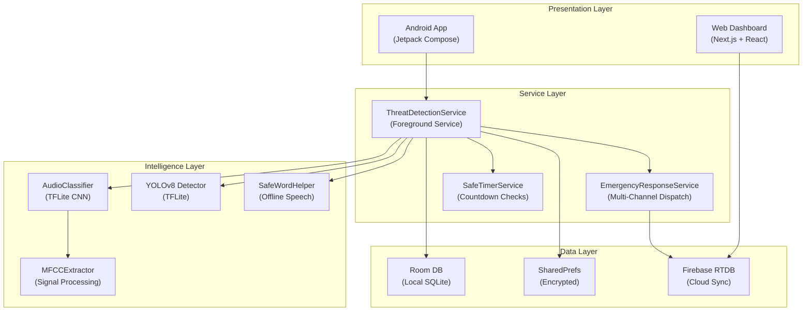

---

## FIGURE 3.2: Context-Level DFD (Level 0)

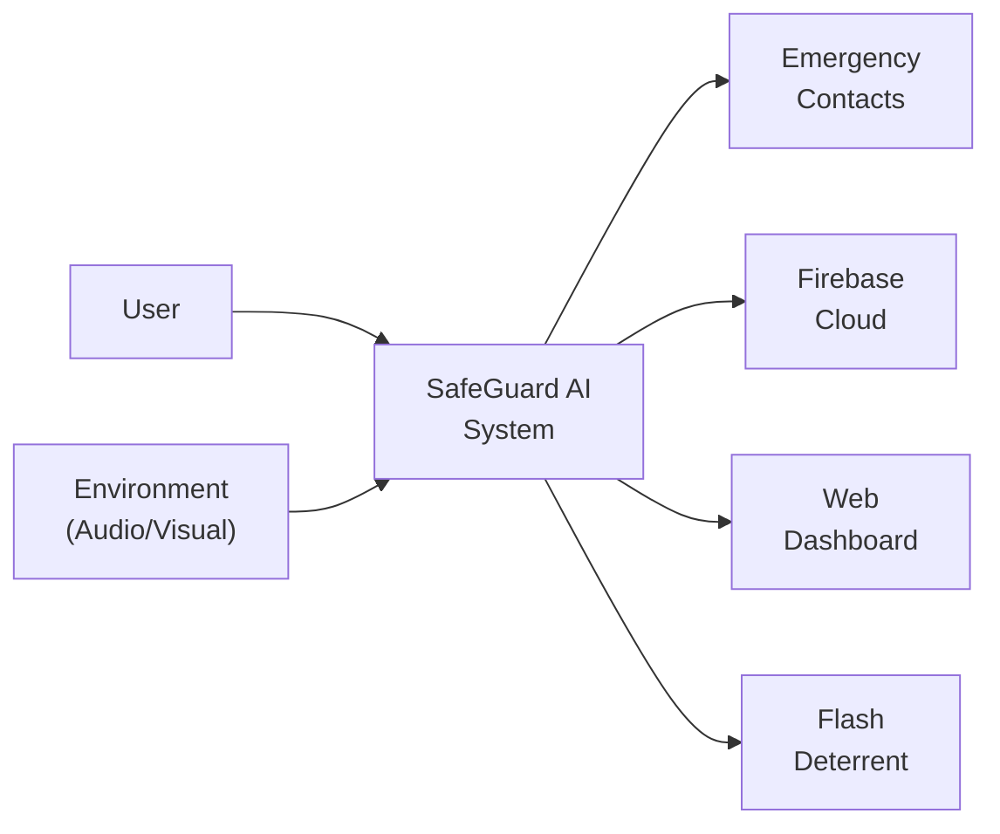

---

## FIGURE 3.3: Level 1 DFD - Threat Detection Subsystem

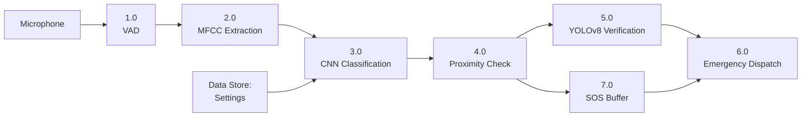

---

## FIGURE 3.4: Level 2 DFD - Emergency Response Subsystem

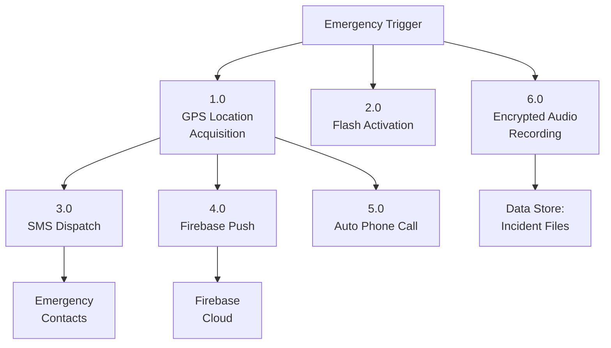

---

## FIGURE 3.5: UML Class Diagram

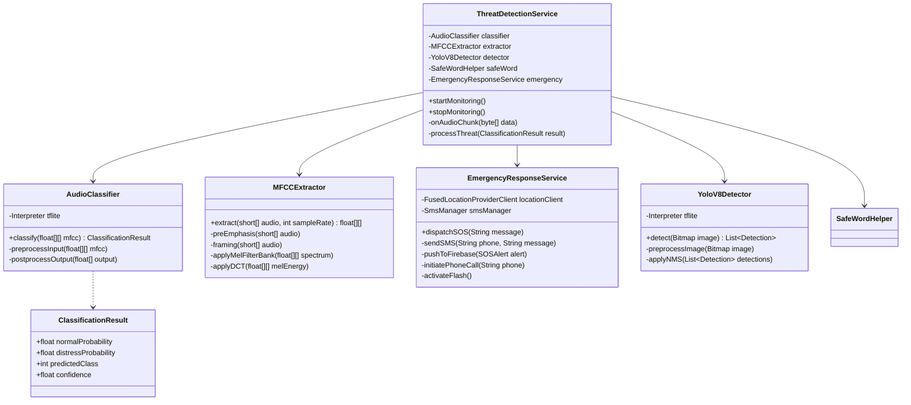

---

## FIGURE 3.6: UML Sequence Diagram - Threat Detection Flow

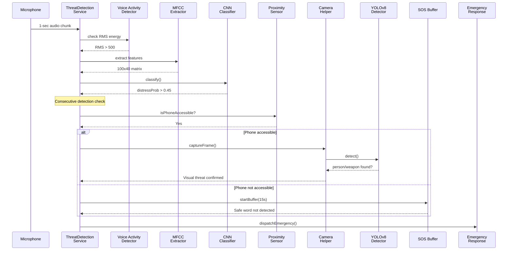

---

## FIGURE 3.7: UML Activity Diagram - Emergency Response

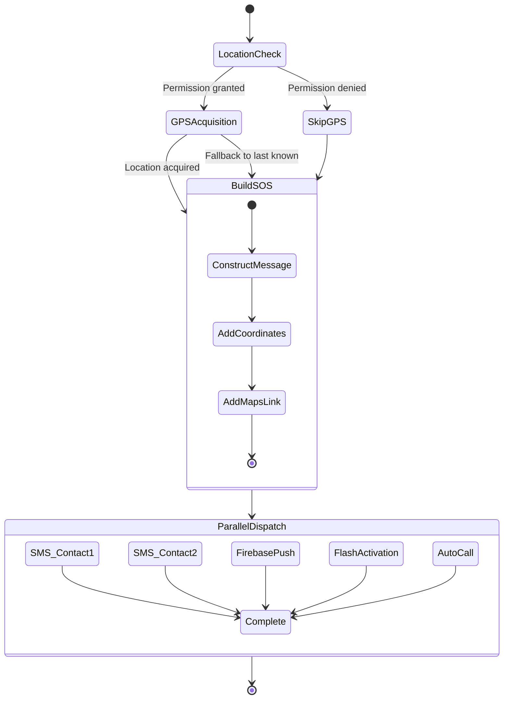

---

## FIGURE 3.8: Use Case Diagram - User Interactions

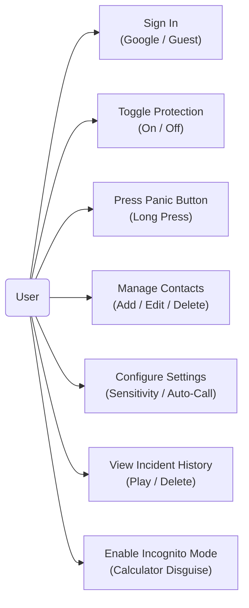

---

## FIGURE 3.9: Use Case Diagram - System Operations

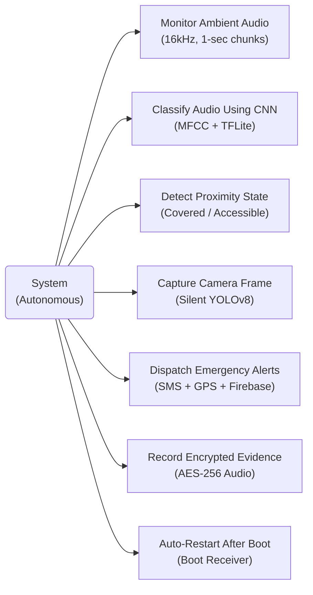

---

## FIGURE 3.10: Main Application Flowchart

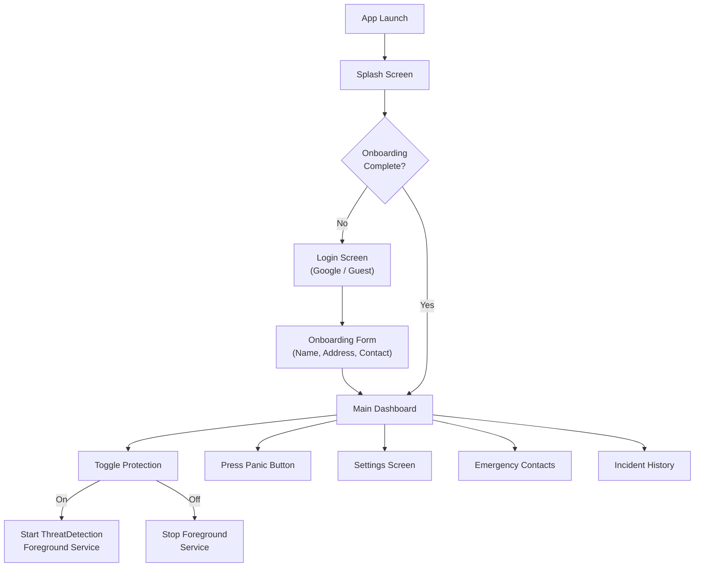

---

## FIGURE 3.11: Audio Classification Pipeline Flowchart

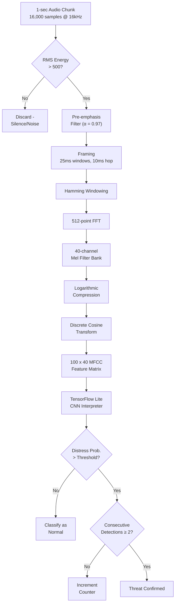

---

## FIGURE 3.12: Emergency Dispatch Protocol Flowchart

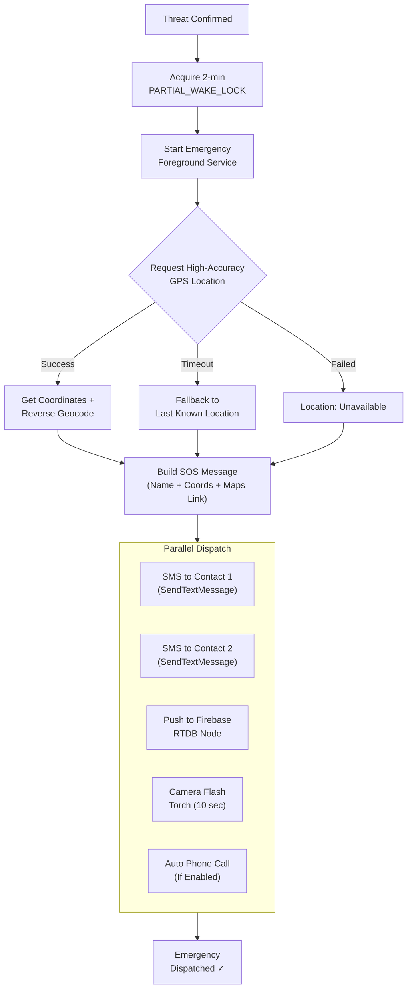

---

## FIGURE 3.13: Entity-Relationship Diagram

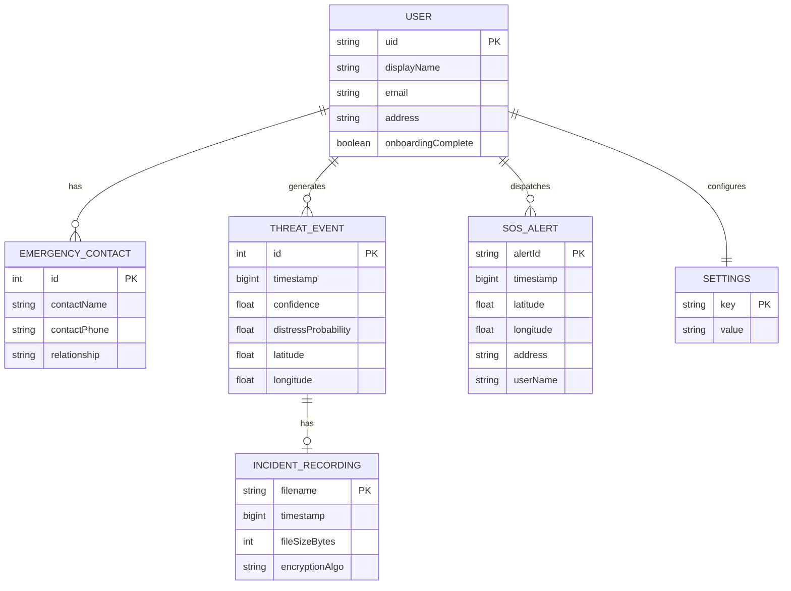

---

## FIGURE 4.1: Android Login and Onboarding Screens

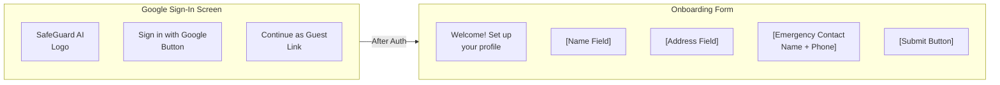

---

## FIGURE 4.2: Main Dashboard Screen

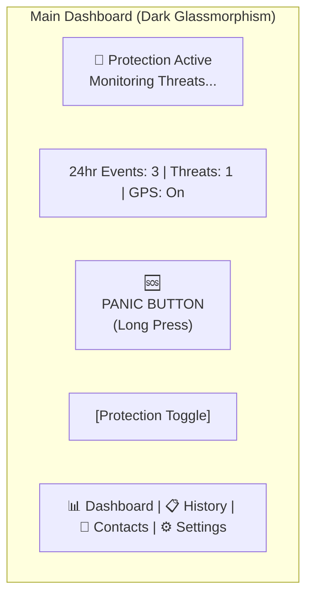

---

## FIGURE 4.3: Camera Capture and YOLOv8 Verification View

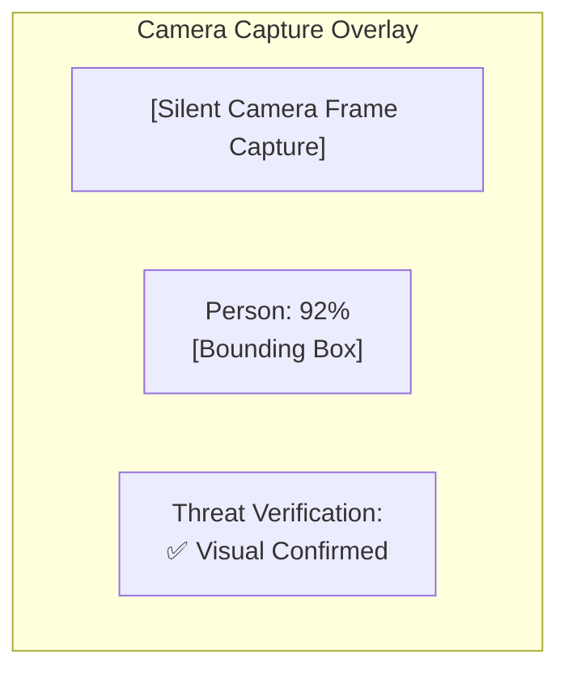

---

## FIGURE 4.4: SOS Alert and Emergency Dispatch Screens

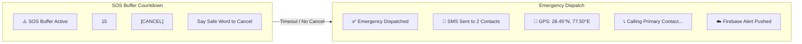

---

## FIGURE 4.5: Incident History Screen

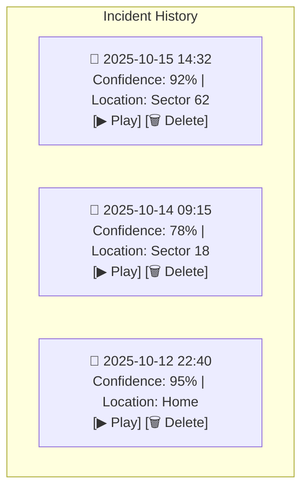

---

## FIGURE 4.6: Calculator Incognito Mode Screen

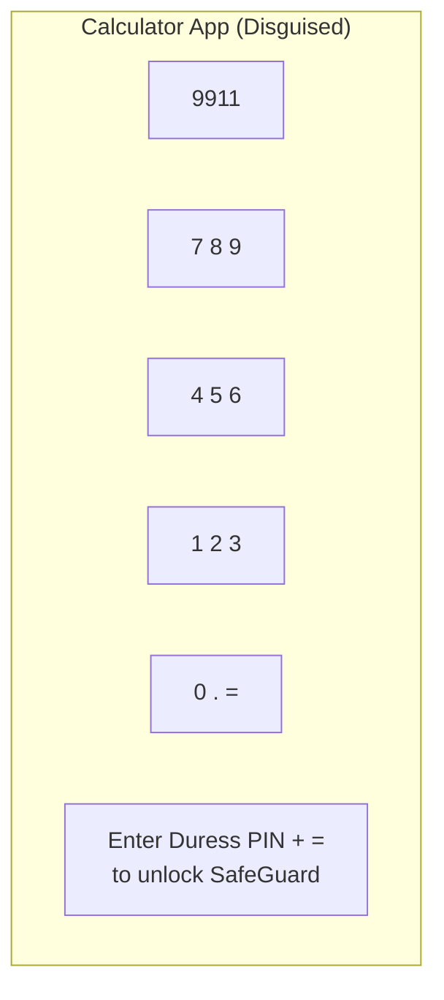

---

## FIGURE 4.7: Safe Timer Setup Screen

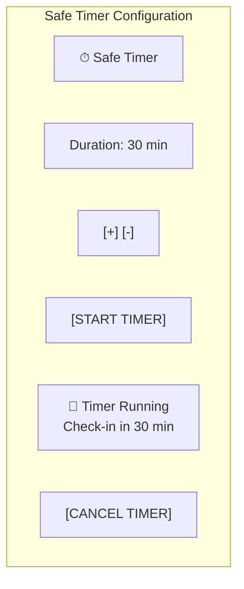

---

## FIGURE 4.8: Web Dashboard Interface

```mermaid
graph TB
    subgraph WEB_DASH["Web Dashboard - Live Monitoring"]
        LOGO["SafeGuard AI | Live Monitor"]
        METRICS_WEB["📊 Events Today: 12 | Active Threats: 2 | GPS: Online"]
        
        subgraph FEED["Live Alert Feed"]
            ALERT1["🔴 HIGH CONFIDENCE - 92%<br/>📍 Sector 62, Noida | 🕐 14:32:15"]
            ALERT2["🟡 MEDIUM CONFIDENCE - 78%<br/>📍 Sector 18, Noida | 🕐 09:15:22"]
            ALERT3["🔴 HIGH CONFIDENCE - 95%<br/>📍 Home Address | 🕐 22:40:01"]
        end
        
        TABS["📊 Dashboard | 📋 History | 👤 Contacts | ⚙️ Settings"]
    end
```

---

## How to Export Each Image

1. Go to **[https://mermaid.live](https://mermaid.live)**
2. Copy each individual diagram code (between ```mermaid and ```)
3. Paste into the left panel
4. Set export width to **1000px** for landscape / **800px** for portrait
5. Export as PNG and save with the figure name, e.g. `figure_3_1_system_architecture.png`
6. Paste into the PDF manually at the corresponding location

**File naming suggestion for all 21 PNGs:**
```
figure_3_1_system_architecture.png
figure_3_2_context_dfd.png
figure_3_3_level1_dfd.png
figure_3_4_level2_dfd.png
figure_3_5_uml_class.png
figure_3_6_uml_sequence.png
figure_3_7_uml_activity.png
figure_3_8_use_case_user.png
figure_3_9_use_case_system.png
figure_3_10_flow_app.png
figure_3_11_flow_audio.png
figure_3_12_flow_emergency.png
figure_3_13_er_diagram.png
figure_4_1_login_onboarding.png
figure_4_2_dashboard.png
figure_4_3_camera_yolo.png
figure_4_4_sos_emergency.png
figure_4_5_incident_history.png
figure_4_6_calculator.png
figure_4_7_safe_timer.png
figure_4_8_web_dashboard.png
```
