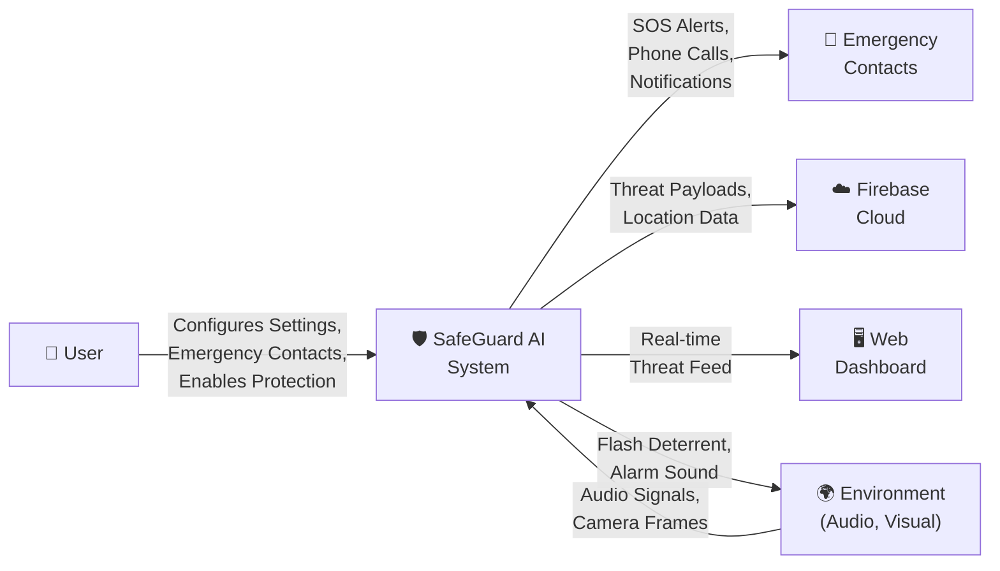
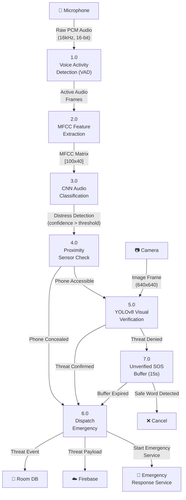
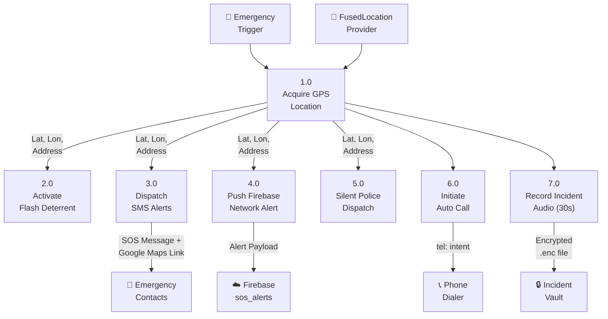
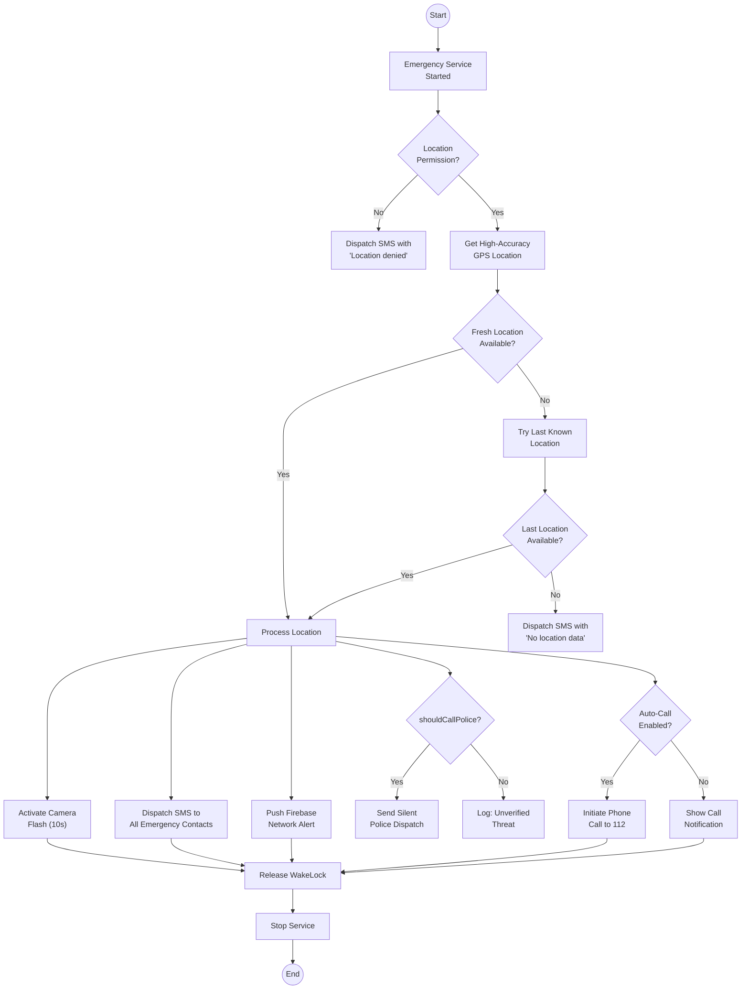
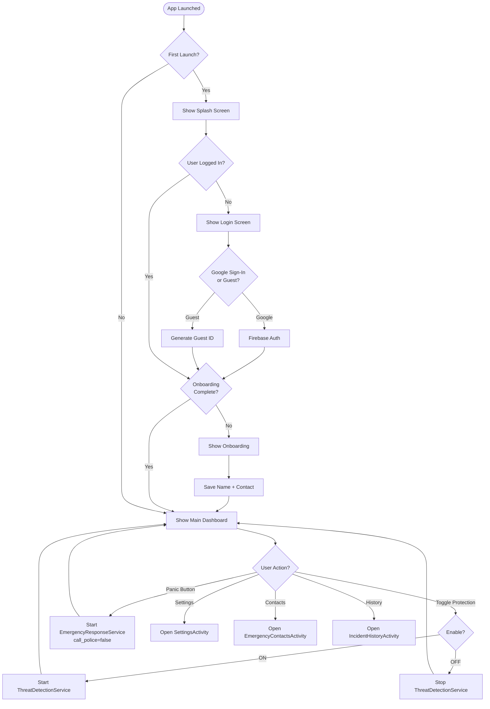
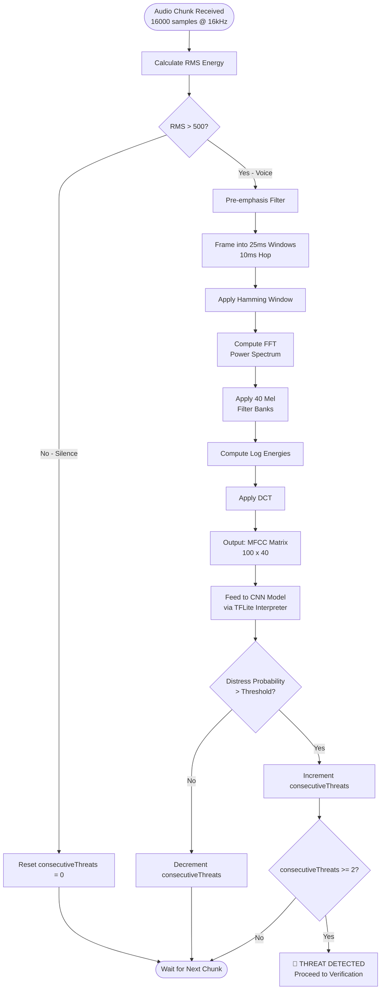
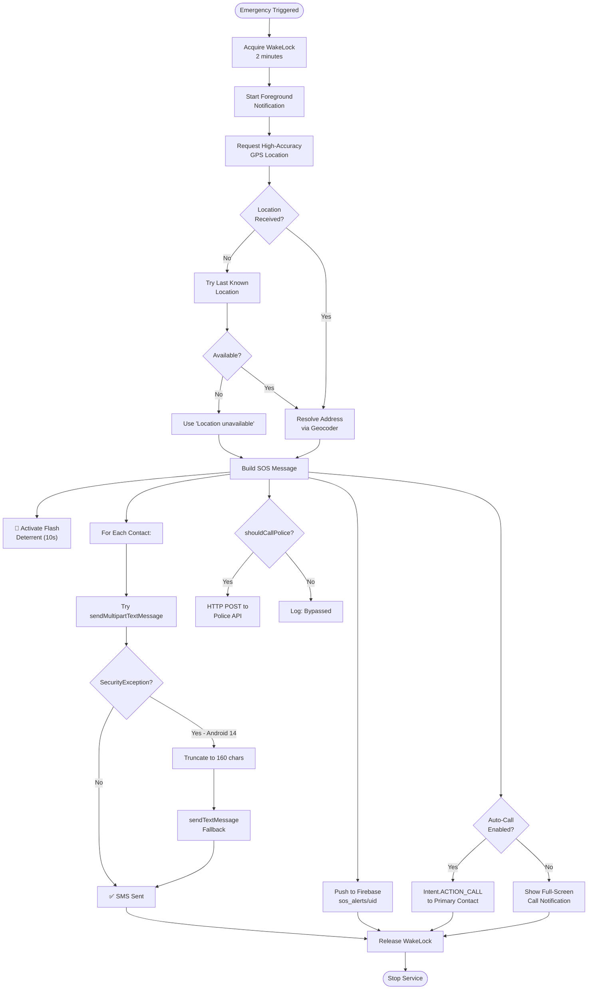

<style>
  @page {
    margin: 1in 1in 1in 1.5in;
  }
  body {
    font-family: 'Times New Roman', Times, serif;
    font-size: 16pt;
    line-height: 2.2;
    text-align: justify;
  }
  h1 {
    font-size: 26pt;
    text-align: center;
    page-break-before: always;
    margin-top: 1in;
    margin-bottom: 0.5in;
  }
  h2 {
    font-size: 22pt;
    page-break-before: always;
    margin-top: 0.5in;
  }
  h3 {
    font-size: 18pt;
    margin-top: 0.5in;
  }
  p {
    margin-bottom: 20px;
  }
  pre, code {
    font-size: 12pt;
    line-height: 1.5;
  }
  table {
    width: 100%;
    font-size: 14pt;
    line-height: 1.5;
    margin: 0.5in 0;
    border-collapse: collapse;
  }
  th, td {
    padding: 12px;
    border: 1px solid black;
  }
</style>

# SafeGuard AI: An AI-Driven Audio-Triggered Threat Detection and Alert System

<br>

---

<br>

**A Project Report**
**Submitted in partial fulfillment of the requirements for the degree of**
**Master of Computer Applications (MCA)**

<br>

---

<br>

**Submitted By:**
**Name:** [YOUR NAME]
**Register No:** MCA2249
**Department of Computer Applications**

<br>

---

<br>

**Under the Guidance of**
**[GUIDE NAME]**
**[DESIGNATION]**

<br>

---

<br>

**[COLLEGE NAME]**
**[UNIVERSITY NAME]**
**[YEAR]**

<br>

---

<br>

\newpage

<br>


<div style="page-break-before: always;"></div>
## CERTIFICATE

<br>

This is to certify that the Project Report titled **"SafeGuard AI: An AI-Driven Audio-Triggered Threat Detection and Alert System"** submitted by **[YOUR NAME]** (Reg. No: MCA2249) is a bonafide record of the work done during the academic year 2025-2026 in partial fulfillment of the requirements for the award of the degree of **Master of Computer Applications**.

<br>

| | |
|---|---|
| **Internal Guide** | **Head of Department** |
| | |
| Signature: \_\_\_\_\_\_\_\_\_\_\_\_\_\_\_ | Signature: \_\_\_\_\_\_\_\_\_\_\_\_\_\_\_ |
| Name: | Name: |
| Date: | Date: |

<br>

**External Examiner**
Signature: \_\_\_\_\_\_\_\_\_\_\_\_\_\_\_
Name:
Date:

<br>

---

<br>

\newpage

<br>


<div style="page-break-before: always;"></div>
## DECLARATION

<br>

I hereby declare that the project entitled **"SafeGuard AI: An AI-Driven Audio-Triggered Threat Detection and Alert System"** submitted for the degree of Master of Computer Applications is my original work and has not been submitted to any other University or Institution for the award of any degree or diploma.

<br>

| | |
|---|---|
| Place: | Signature: \_\_\_\_\_\_\_\_\_\_\_\_\_\_\_ |
| Date: | Name: [YOUR NAME] |

<br>

---

<br>

\newpage

<br>


<div style="page-break-before: always;"></div>
## ACKNOWLEDGEMENT

<br>

I would like to express my sincere gratitude to my project guide **[GUIDE NAME]** for their invaluable guidance, encouragement, and support throughout the development of this project. Their expertise in the field of machine learning and mobile computing was instrumental in shaping this work.

<br>

I am grateful to **[HOD NAME]**, Head of the Department of Computer Applications, for providing the necessary infrastructure and support.

<br>

I also extend my thanks to all faculty members who have directly or indirectly contributed to the successful completion of this project.

<br>

Finally, I would like to thank my family and friends for their constant support and encouragement.

<br>

---

<br>

\newpage

<br>


<div style="page-break-before: always;"></div>
## TABLE OF CONTENTS

<br>

| Chapter | Title | Page No. |
|---|---|---|
| | Abstract | i |
| 1 | Introduction | 1 |
| 1.1 | Background and Motivation | 1 |
| 1.2 | Problem Statement | 3 |
| 1.3 | Objectives | 4 |
| 1.4 | Scope of the Project | 5 |
| 1.5 | Organization of the Report | 6 |
| 2 | Literature Survey | 7 |
| 2.1 | Audio-Based Threat Detection | 7 |
| 2.2 | Mel-Frequency Cepstral Coefficients (MFCC) | 9 |
| 2.3 | Convolutional Neural Networks for Audio | 11 |
| 2.4 | Object Detection Using YOLO | 13 |
| 2.5 | Multimodal Sensor Fusion | 15 |
| 2.6 | Android Foreground Services and Background Restrictions | 17 |
| 2.7 | Personal Safety Applications — Comparative Analysis | 19 |
| 2.8 | Firebase Realtime Database | 21 |
| 2.9 | Summary of Literature Review | 22 |
| 3 | Project Design | 23 |
| 3.1 | System Architecture | 23 |
| 3.2 | Data Flow Diagrams (DFD) | 25 |
| 3.3 | UML Diagrams | 29 |
| 3.4 | Use Case Diagrams | 33 |
| 3.5 | Flowcharts | 36 |
| 3.6 | Entity-Relationship (ER) Diagram | 40 |
| 3.7 | Database Design | 42 |
| 3.8 | Technology Stack | 44 |
| 4 | Modules Description | 46 |
| 4.1 | Authentication Module | 46 |
| 4.2 | Threat Detection Module | 48 |
| 4.3 | Visual Verification Module | 50 |
| 4.4 | Emergency Response Module | 52 |
| 4.5 | Incident Vault Module | 54 |
| 4.6 | Incognito Mode Module | 55 |
| 4.7 | Safe Timer Module | 56 |
| 4.8 | Web Dashboard Module | 57 |
| 5 | Results | 58 |
| 5.1 | Application Screenshots | 58 |
| 5.2 | Performance Metrics | 62 |
| 5.3 | Testing Results | 64 |
| 6 | Conclusion and Future Enhancement | 66 |
| 6.1 | Conclusion | 66 |
| 6.2 | Future Enhancements | 67 |
| | References | 69 |

<br>

---

<br>

\newpage

<br>


<div style="page-break-before: always;"></div>
## LIST OF FIGURES

<br>

| Fig. No. | Title | Page No. |
|---|---|---|
| 3.1 | System Architecture Diagram | 23 |
| 3.2 | Context-Level DFD (Level 0) | 25 |
| 3.3 | Level 1 DFD — Threat Detection Subsystem | 26 |
| 3.4 | Level 2 DFD — Emergency Response Subsystem | 27 |
| 3.5 | UML Class Diagram | 29 |
| 3.6 | UML Sequence Diagram — Threat Detection Flow | 31 |
| 3.7 | UML Activity Diagram — Emergency Response | 32 |
| 3.8 | Use Case Diagram — User Interactions | 33 |
| 3.9 | Use Case Diagram — System Operations | 34 |
| 3.10 | Flowchart — Main Application Flow | 36 |
| 3.11 | Flowchart — Audio Classification Pipeline | 37 |
| 3.12 | Flowchart — Emergency Dispatch Protocol | 38 |
| 3.13 | ER Diagram — Database Schema | 40 |

<br>

---

<br>

\newpage

<br>


<div style="page-break-before: always;"></div>
## LIST OF TABLES

<br>

| Table No. | Title | Page No. |
|---|---|---|
| 2.1 | Comparison of Existing Safety Applications | 20 |
| 3.1 | Technology Stack Summary | 44 |
| 3.2 | Database Schema — threat_events Table | 42 |
| 3.3 | Database Schema — Emergency Contacts (SharedPreferences) | 43 |
| 3.4 | Firebase Realtime Database Schema | 43 |
| 5.1 | ML Model Performance Metrics | 62 |
| 5.2 | System Performance Benchmarks | 63 |
| 5.3 | Test Case Results Summary | 64 |

<br>

---

<br>

\newpage

<br>


<div style="page-break-before: always;"></div>
## ABSTRACT

<br>

Personal safety remains a critical concern in urban and rural environments worldwide. Existing safety applications depend heavily on manual user interaction — requiring the victim to unlock their phone, open an application, and press a panic button — actions that are often impossible during an actual emergency. This project presents **SafeGuard AI**, a zero-click, AI-driven personal safety application for Android that autonomously detects threats and dispatches emergency protocols without requiring any user intervention.

<br>

SafeGuard AI employs a multimodal sensor fusion architecture combining **on-device machine learning** with real-time sensor data. The system operates as a persistent background service that continuously monitors ambient audio through the device microphone. Audio samples are processed through a feature extraction pipeline using **Mel-Frequency Cepstral Coefficients (MFCC)**, and classified using a **Convolutional Neural Network (CNN)** model deployed via TensorFlow Lite. When distress sounds (screams, calls for help) are detected, the system performs context-aware visual verification using a **YOLOv8 object detection** model to confirm the presence of threatening elements (persons, weapons) in the environment.

<br>

Upon threat confirmation, the application autonomously executes a multi-channel emergency response protocol: GPS-tagged SMS alerts to pre-configured emergency contacts, automatic phone calls to primary contacts or emergency services (112), real-time threat payload push to a Firebase Realtime Database for web dashboard monitoring, encrypted audio incident recording for forensic evidence, and a camera LED flash strobe as a visual deterrent. The system also features an **Unverified SOS Buffer** with voice-activated cancellation using offline speech recognition, an **Incognito Mode** that disguises the application as a calculator, a **Hazard Zone Proximity Alert** system, and a **Safe Timer** feature.

<br>

All machine learning inference is performed entirely on-device, ensuring zero data transmission to external servers and maximum user privacy. The system is engineered to be resilient against Android 11–14 background execution restrictions, including foreground service type requirements, battery optimization, and SMS security policies.

<br>

**Keywords:** Audio Classification, MFCC, CNN, YOLOv8, Object Detection, TensorFlow Lite, Android Foreground Service, Personal Safety, Multimodal Sensor Fusion, Firebase

<br>

---

<br>

\newpage

<br>


<div style="page-break-before: always;"></div>
## CHAPTER 1: INTRODUCTION

<br>

#
<div style="page-break-before: always;"></div>
## 1.1 Background and Motivation

<br>

The World Health Organization reports that approximately 1.3 million people die annually from violence-related injuries, and millions more suffer non-fatal injuries. According to the National Crime Records Bureau (NCRB) of India, over 4 lakh cognizable crimes against women were reported in 2022 alone, including assault, kidnapping, and sexual offences. A significant challenge in addressing these incidents is the delay between the occurrence of a threatening event and the initiation of emergency response.

<br>

Traditional emergency response systems are fundamentally reactive — they require conscious, deliberate action by the victim to call emergency services (such as dialing 112 in India or 911 in the United States). However, in life-threatening situations, the ability to perform such actions is frequently compromised. The victim may be physically restrained, in a state of panic, or unable to access their mobile device. This critical gap between threat occurrence and emergency response represents a significant challenge that technology can address.

<br>

The rapid advancement of mobile computing hardware has made smartphones extraordinarily capable devices for real-time sensing and computation. Modern smartphones are equipped with high-fidelity microphones, multi-megapixel cameras, GPS receivers, accelerometers, proximity sensors, and dedicated neural processing units — all connected to high-speed cellular networks. These hardware capabilities, combined with advances in edge computing and optimized machine learning frameworks like TensorFlow Lite, enable sophisticated on-device AI applications that can perceive and respond to environmental threats autonomously.

<br>

The motivation for SafeGuard AI arises from the critical need for a **proactive** rather than **reactive** safety system. Instead of requiring the user to manually trigger an alarm during a crisis, SafeGuard AI leverages the device's always-available microphone and camera to autonomously detect distress situations and initiate emergency protocols — all without any user interaction. This "zero-click" paradigm fundamentally reimagines personal safety by shifting from user-dependent to AI-dependent threat detection and response.

<br>

Furthermore, privacy is a paramount concern in any system that monitors audio and video feeds. Unlike cloud-based voice assistants that transmit audio data to remote servers for processing, SafeGuard AI performs all machine learning inference entirely on the device. No audio recordings or camera captures are ever transmitted to external servers. The audio buffer is overwritten every second, and camera frames are discarded immediately after YOLOv8 processing. This privacy-first architecture ensures that the system provides maximum safety without compromising user privacy.

<br>

#
<div style="page-break-before: always;"></div>
## 1.2 Problem Statement

<br>

Existing personal safety applications suffer from several critical limitations:

<br>

1. **Manual Activation Requirement:** Applications like bSafe, Shake2Safety, and Life360 require the user to actively press a panic button or perform a specific gesture (such as shaking the phone). During an actual emergency, the victim may be unable to perform these actions due to physical restraint, injury, or psychological shock.

<br>

2. **Limited Threat Detection Capability:** Current applications lack the ability to autonomously identify threatening situations. They function purely as communication tools rather than intelligent threat detection systems. No existing consumer application employs real-time audio classification or visual verification for autonomous threat detection.

<br>

3. **Cloud Dependency and Privacy Concerns:** Many existing solutions require active internet connectivity for core functionality and transmit sensitive data (including location, audio, and video) to cloud servers for processing, raising significant privacy and security concerns.

<br>

4. **Fragile Background Execution:** Android's progressive tightening of background execution policies (starting with Doze mode in Android 6, background execution limits in Android 8, and foreground service type restrictions in Android 14) has rendered many older safety applications unreliable. They are frequently killed by the operating system when running in the background, defeating their primary purpose.

<br>

5. **High False Positive Rate:** Applications that rely on single-sensor detection (such as shake detection alone) suffer from unacceptably high false positive rates, leading to "cry wolf" scenarios where users and emergency contacts lose trust in the system.

<br>

6. **No Forensic Evidence Collection:** Most safety applications do not capture any evidence during an incident. When law enforcement arrives, there is no audio, video, or environmental data to support the victim's account.

<br>

SafeGuard AI addresses each of these limitations through a comprehensive, multi-layered approach combining on-device machine learning, multimodal sensor fusion, privacy-preserving architecture, and resilient background execution.

<br>

#
<div style="page-break-before: always;"></div>
## 1.3 Objectives

<br>

The primary objectives of this project are:

<br>

1. **Design and implement a zero-click autonomous threat detection system** that continuously monitors ambient audio using on-device machine learning to identify distress sounds (screams, calls for help) without any user interaction.

<br>

2. **Develop a multimodal sensor fusion pipeline** that combines audio classification (MFCC + CNN), visual verification (YOLOv8 object detection), and proximity sensing to minimize false positives and confirm genuine threats.

<br>

3. **Implement a multi-channel emergency response protocol** that autonomously dispatches GPS-tagged SMS alerts, initiates automatic phone calls, pushes real-time threat data to a Firebase cloud database, and activates visual deterrents.

<br>

4. **Ensure privacy-first architecture** where all machine learning inference is performed entirely on-device, with no audio or video data transmitted to external servers.

<br>

5. **Build a resilient background service** that operates reliably within the constraints of Android 11–14 background execution restrictions, including foreground service type requirements and battery optimization policies.

<br>

6. **Develop an Unverified SOS Buffer mechanism** with voice-activated cancellation (Safe Words) to prevent false alarms while maintaining rapid response to genuine threats.

<br>

7. **Create forensic evidence collection** through encrypted audio incident recording that captures 30 seconds of ambient audio during confirmed threats for later review.

<br>

8. **Design an Incognito Mode** that disguises the application as a calculator to prevent potential attackers from identifying and disabling the safety application.

<br>

9. **Develop a web-based monitoring dashboard** using Firebase Realtime Database and Next.js for real-time remote monitoring of threat events by trusted contacts or security personnel.

<br>

#
<div style="page-break-before: always;"></div>
## 1.4 Scope of the Project

<br>

The scope of SafeGuard AI encompasses the following:

<br>

**In Scope:**
- Android mobile application (API 26–34, Android 8.0–14.0)
- On-device audio classification using TensorFlow Lite (MFCC + CNN)
- On-device visual verification using YOLOv8 Nano via TensorFlow Lite
- Multi-channel emergency dispatch (SMS, Phone Call, Firebase Cloud, LED Flash)
- Offline speech recognition for Safe Word / Trigger Word detection
- Encrypted incident audio recording (AES encryption)
- Room database for local threat event storage
- Firebase Realtime Database integration for cloud sync
- Firebase Authentication (Google Sign-In) and Guest Mode
- Web dashboard for remote monitoring (Next.js + Firebase)
- Incognito Mode with calculator disguise
- Boot recovery and periodic health checks
- Hazard zone proximity alerts using historical incident data

<br>

**Out of Scope:**
- iOS application development
- Custom ML model training (pre-trained models are used)
- Integration with government emergency response infrastructure (e.g., ERSS 112 API)
- Wearable device integration (smartwatches)
- Real-time video streaming to emergency contacts

<br>

#
<div style="page-break-before: always;"></div>
## 1.5 Organization of the Report

<br>

This report is organized into six chapters:

<br>

- **Chapter 1 — Introduction:** Provides background, motivation, problem statement, objectives, and scope.
- **Chapter 2 — Literature Survey:** Reviews existing research in audio classification, object detection, sensor fusion, and personal safety applications.
- **Chapter 3 — Project Design:** Presents the system architecture, data flow diagrams, UML diagrams, use case diagrams, flowcharts, ER diagrams, and database design.
- **Chapter 4 — Modules Description:** Provides detailed technical descriptions of each functional module.
- **Chapter 5 — Results:** Showcases application screenshots, performance metrics, and testing outcomes.
- **Chapter 6 — Conclusion and Future Enhancement:** Summarizes accomplishments and proposes directions for future development.

<br>

---

<br>

\newpage

<br>


<div style="page-break-before: always;"></div>
## CHAPTER 2: LITERATURE SURVEY

<br>

#
<div style="page-break-before: always;"></div>
## 2.1 Audio-Based Threat Detection

<br>

Audio event detection and classification has been an active area of research in the machine learning community. The task involves identifying specific sounds or acoustic events from continuous audio streams, which has applications in surveillance, security, wildlife monitoring, and health monitoring.

<br>

**Salamon and Bello (2017)** proposed an approach for environmental sound classification using deep convolutional neural networks. Their work demonstrated that CNNs trained on mel-spectrogram representations of audio signals could achieve state-of-the-art performance on benchmark datasets such as UrbanSound8K and ESC-50. They achieved classification accuracies of 73.7% on UrbanSound8K using raw audio features and improved to 79.0% using data augmentation techniques including time stretching, pitch shifting, and background noise injection.

<br>

**Piczak (2015)** pioneered the use of deep learning for environmental sound classification, demonstrating that convolutional neural networks could learn discriminative audio features directly from spectrograms without hand-crafted feature engineering. This work established the ESC-50 dataset as a benchmark for environmental audio classification and demonstrated that 2D CNN architectures designed for image recognition could be effectively repurposed for audio classification by treating spectrograms as images.

<br>

**Laffitte et al. (2019)** explored the specific application of audio-based threat detection in urban environments. Their work focused on detecting aggressive sounds such as screams, gunshots, and breaking glass using a combination of MFCC features and recurrent neural networks (RNNs). They reported detection accuracies exceeding 90% for gunshots and 85% for screams in controlled environments, though performance degraded significantly in noisy real-world conditions.

<br>

**Hertel et al. (2016)** compared various deep learning architectures for audio scene classification, including fully connected networks, CNNs, and recurrent networks. Their findings indicated that CNN architectures consistently outperformed other approaches when applied to mel-spectrogram representations, achieving the best balance between classification accuracy and computational efficiency — a critical consideration for resource-constrained mobile deployment.

<br>

**Relevance to SafeGuard AI:** Our system builds upon these foundational works by deploying a CNN-based audio classifier on-device using TensorFlow Lite. We specifically focus on distress sound detection (screams, calls for help) using MFCC feature extraction, which provides a compact yet highly discriminative representation of audio characteristics. Unlike cloud-based approaches, our system operates entirely offline, ensuring zero-latency inference and maximum privacy.

<br>

#
<div style="page-break-before: always;"></div>
## 2.2 Mel-Frequency Cepstral Coefficients (MFCC)

<br>

Mel-Frequency Cepstral Coefficients have been the dominant feature representation for audio and speech processing tasks since their introduction by **Davis and Mermelstein (1980)**. MFCCs are derived through a series of signal processing operations that approximate the human auditory system's perception of sound frequencies.

<br>

The MFCC extraction pipeline consists of the following steps:

<br>

1. **Pre-emphasis:** A high-pass filter is applied to amplify high-frequency components that are typically attenuated during sound recording.

<br>

2. **Framing and Windowing:** The audio signal is divided into short overlapping frames (typically 20–40ms with 50% overlap), and a Hamming window function is applied to reduce spectral leakage.

<br>

3. **Fast Fourier Transform (FFT):** Each frame is transformed from the time domain to the frequency domain using the FFT, producing a power spectrum.

<br>

4. **Mel Filter Bank:** The power spectrum is passed through a bank of triangular bandpass filters spaced on the mel frequency scale, which is a perceptual scale of pitch based on human hearing characteristics. The mel scale is approximately linear below 1000 Hz and logarithmic above 1000 Hz.

<br>

5. **Logarithm:** The logarithm of the mel filter bank energies is computed to compress the dynamic range, mimicking the human ear's logarithmic perception of loudness.

<br>

6. **Discrete Cosine Transform (DCT):** The DCT is applied to the log mel-filter bank energies to produce the final MFCC coefficients. Typically, the first 13–40 coefficients are retained as features.

<br>

**Zheng et al. (2001)** conducted a comprehensive comparison of MFCC with other spectral features (including linear prediction cepstral coefficients and perceptual linear prediction) and found that MFCC consistently provided superior performance for speech and audio recognition tasks. **Ganchev et al. (2005)** further validated the robustness of MFCC features across different acoustic environments and recording conditions.

<br>

**Relevance to SafeGuard AI:** Our system extracts 40 MFCC coefficients from each 1-second audio frame at a 16kHz sampling rate, producing a feature matrix of dimension [100 × 40] (100 time steps × 40 MFCC coefficients). This representation captures the spectral envelope characteristics of distress sounds while being computationally efficient enough for real-time processing on mobile hardware.

<br>

#
<div style="page-break-before: always;"></div>
## 2.3 Convolutional Neural Networks for Audio Classification

<br>

Convolutional Neural Networks, originally designed for image recognition tasks, have proven remarkably effective for audio classification when applied to 2D spectral representations of audio signals.

<br>

**Hershey et al. (2017)** from Google Research published a seminal paper on CNN architectures for large-scale audio classification. They evaluated multiple architectures including VGGish, ResNet, and Inception on the AudioSet dataset containing over 2 million human-annotated audio clips spanning 632 audio event classes. Their VGGish architecture, a simplified version of VGGNet adapted for audio spectrograms, achieved a mean average precision (mAP) of 0.314 on this large-scale dataset and has since become a standard baseline for audio classification research.

<br>

**Kong et al. (2020)** proposed PANNs (Pretrained Audio Neural Networks) — large-scale pretrained CNNs for audio pattern recognition. Their CNN14 architecture achieved a mAP of 0.431 on AudioSet, representing a significant improvement over earlier approaches. They demonstrated that pretrained audio neural networks could be effectively transferred to downstream tasks through fine-tuning, similar to the transfer learning paradigm in computer vision.

<br>

**Abdoli et al. (2019)** explored end-to-end convolutional neural networks that operate directly on raw audio waveforms rather than spectrograms, eliminating the need for explicit feature extraction. While this approach showed promise for some tasks, spectrogram-based methods (MFCC + CNN) generally achieved superior performance for environmental sound classification tasks relevant to threat detection.

<br>

**LeCun et al. (2015)** provided a comprehensive review of deep learning fundamentals, including the theoretical basis for convolutional neural networks. Their explanation of how CNNs exploit spatial (and temporal) locality through weight sharing and pooling operations provides the theoretical foundation for understanding why CNNs are effective for spectrogram-based audio classification — spectrograms exhibit local correlations in both time and frequency dimensions that CNNs can efficiently capture.

<br>

**Relevance to SafeGuard AI:** Our audio classification model uses a CNN architecture optimized for mobile deployment via TensorFlow Lite. The model takes MFCC feature matrices as input and produces a binary classification (Normal vs. Distress) with associated confidence scores. The model is quantized for efficient inference on mobile CPUs, achieving sub-second inference times on mid-range Android devices.

<br>

#
<div style="page-break-before: always;"></div>
## 2.4 Object Detection Using YOLO

<br>

You Only Look Once (YOLO) is a family of real-time object detection algorithms that fundamentally changed the approach to object detection by framing it as a single regression problem rather than a multi-stage pipeline.

<br>

**Redmon et al. (2016)** introduced YOLOv1, which divided the input image into a grid and predicted bounding boxes and class probabilities simultaneously in a single forward pass through a neural network. This approach achieved dramatic speed improvements over region-based methods (R-CNN family), enabling real-time object detection at 45 FPS while maintaining competitive accuracy.

<br>

**Redmon and Farhadi (2018)** introduced YOLOv3, which incorporated multi-scale detection using feature pyramid networks, significantly improving detection accuracy for small objects while maintaining real-time performance. YOLOv3 achieved 57.9 AP₅₀ on the COCO dataset while running at approximately 20 FPS on a GPU.

<br>

**Jocher et al. (2023)** developed YOLOv8, the latest generation, which introduced architectural improvements including a C2f (Cross Stage Partial Bottleneck with 2 convolutions) module, an anchor-free detection head, and a decoupled head design for classification and regression. YOLOv8 is available in five model sizes: Nano (n), Small (s), Medium (m), Large (l), and Extra Large (x), enabling deployment across a wide range of hardware platforms.

<br>

YOLOv8 Nano (YOLOv8n) is specifically designed for edge deployment, with only 3.2 million parameters and 8.7 GFLOPs. When converted to TensorFlow Lite format, it can run inference on mobile devices in approximately 100–300ms per frame, making it suitable for real-time on-device visual verification.

<br>

The model is trained on the COCO (Common Objects in Context) dataset containing 80 object classes, including categories directly relevant to threat detection: person (class 0), knife (class 43), and baseball bat (class 34).

<br>

**Relevance to SafeGuard AI:** We deploy YOLOv8 Nano in Float32 TensorFlow Lite format for on-device visual verification. When the audio classifier detects a potential threat, the system silently captures a frame from the rear camera and runs YOLOv8 inference to detect the presence of persons, knives, or blunt weapons with confidence thresholds of 50%. This visual verification layer significantly reduces false positive rates compared to audio-only detection.

<br>

#
<div style="page-break-before: always;"></div>
## 2.5 Multimodal Sensor Fusion

<br>

Multimodal sensor fusion involves combining data from multiple sensors to achieve more reliable and accurate perception than any single sensor can provide independently.

<br>

**Atrey et al. (2010)** provided a comprehensive survey of multimodal fusion methods for multimedia analysis, categorizing approaches into feature-level fusion (early fusion), decision-level fusion (late fusion), and hybrid fusion strategies. They demonstrated that decision-level fusion — where independent classifiers are trained on each modality and their outputs are combined using voting, weighting, or learned combination functions — generally provides the best balance between accuracy and system flexibility.

<br>

**Radu et al. (2018)** specifically examined multimodal deep learning for activity recognition using smartphone sensors (accelerometer, gyroscope, barometer). They found that fusion of multiple sensor modalities consistently improved recognition accuracy by 5–15% compared to single-modality approaches, and that late fusion strategies were more robust to sensor failures than early fusion.

<br>

**Owens and Efros (2018)** explored audio-visual scene recognition, demonstrating that combining audio and visual cues provides complementary information that improves scene understanding. Their work showed that audio can disambiguate visually similar scenes and vice versa — a principle directly applicable to threat detection where audio distress cues and visual threat indicators provide independent confirmation.

<br>

**Relevance to SafeGuard AI:** Our system implements a sequential decision-level fusion strategy:
1. **Stage 1 (Audio):** CNN-based audio classifier detects distress sounds
2. **Stage 2 (Proximity):** Proximity sensor determines if the phone is concealed (pocket/bag)
3. **Stage 3 (Visual):** If the phone is accessible, YOLOv8 performs visual threat verification
4. **Stage 4 (Voice):** Offline speech recognition listens for safe words or trigger words during the SOS buffer

<br>

This multi-stage fusion ensures high detection accuracy while minimizing false positives through independent cross-modal verification.

<br>

#
<div style="page-break-before: always;"></div>
## 2.6 Android Foreground Services and Background Restrictions

<br>

Android has progressively restricted background execution to improve battery life and system performance, creating significant challenges for always-on monitoring applications.

<br>

**Android 8.0 (API 26)** introduced background execution limits that prevent applications from running background services freely. Applications must use foreground services with visible notifications for any persistent background work.

<br>

**Android 10 (API 29)** introduced foreground service types, requiring applications to declare the specific capabilities they need (microphone, camera, location) in both the manifest and at runtime.

<br>

**Android 12 (API 31)** introduced `ForegroundServiceStartNotAllowedException`, which prevents background-started foreground services in many situations, requiring applications to handle this exception gracefully.

<br>

**Android 14 (API 34)** further tightened restrictions, requiring specific permission declarations (`FOREGROUND_SERVICE_MICROPHONE`, `FOREGROUND_SERVICE_CAMERA`, `FOREGROUND_SERVICE_LOCATION`) and introducing new security policies around SMS operations that can cause `SecurityException` during multi-part message dispatch.

<br>

**Relevance to SafeGuard AI:** Our implementation addresses each of these restrictions through careful service lifecycle management, comprehensive permission declarations, graceful exception handling for `ForegroundServiceStartNotAllowedException`, SMS fallback mechanisms for Android 14 `SecurityException`, and user-guided battery optimization exemption requests.

<br>

#
<div style="page-break-before: always;"></div>
## 2.7 Personal Safety Applications — Comparative Analysis

<br>

Several personal safety applications exist in the market. The following table compares their capabilities with SafeGuard AI:

<br>

**Table 2.1: Comparison of Existing Safety Applications**

<br>

| Feature | bSafe | Shake2Safety | Life360 | Nirbhaya | **SafeGuard AI** |
|---|---|---|---|---|---|
| Autonomous Detection | ❌ | ❌ | ❌ | ❌ | ✅ |
| Audio ML Classification | ❌ | ❌ | ❌ | ❌ | ✅ |
| Visual Verification | ❌ | ❌ | ❌ | ❌ | ✅ |
| Zero-Click Operation | ❌ | ❌ | ❌ | ❌ | ✅ |
| On-Device ML | ❌ | ❌ | ❌ | ❌ | ✅ |
| SMS Alert | ✅ | ✅ | ❌ | ✅ | ✅ |
| Auto Phone Call | ❌ | ✅ | ❌ | ✅ | ✅ |
| GPS Tracking | ✅ | ✅ | ✅ | ✅ | ✅ |
| Incident Recording | ❌ | ❌ | ❌ | ❌ | ✅ (Encrypted) |
| False Alarm Prevention | ❌ | ❌ | N/A | ❌ | ✅ (SOS Buffer) |
| Incognito Mode | ❌ | ❌ | ❌ | ❌ | ✅ |
| Web Dashboard | ❌ | ❌ | ✅ | ❌ | ✅ |
| Offline Operation | ❌ | ✅ | ❌ | ❌ | ✅ |
| Android 14 Compatible | ⚠️ | ⚠️ | ✅ | ❌ | ✅ |

<br>

As demonstrated in the comparison, SafeGuard AI is the only application that provides autonomous AI-driven threat detection with multimodal verification, zero-click operation, and comprehensive evidence collection, while operating entirely offline for the ML inference pipeline.

<br>

#
<div style="page-break-before: always;"></div>
## 2.8 Firebase Realtime Database

<br>

**Firebase Realtime Database** is a cloud-hosted NoSQL database provided by Google that stores data as JSON and synchronizes in real-time across all connected clients. It provides offline capabilities through local data caching, ensuring that data operations complete even when the device is not connected to the internet — the data synchronizes automatically when connectivity is restored.

<br>

**Moroney (2017)** demonstrated the effectiveness of Firebase for real-time mobile application backends, highlighting its sub-second synchronization latency and automatic conflict resolution. Firebase's persistence layer ensures that safety-critical data (threat alerts) is never lost, even in adverse network conditions.

<br>

**Relevance to SafeGuard AI:** We use Firebase Realtime Database for two purposes:
1. **SOS Alert Sync:** When the emergency response protocol executes, threat data (timestamp, GPS coordinates, address, user identity) is pushed to the `sos_alerts` node for real-time monitoring.
2. **Threat Event Sync:** Confirmed threat detections from the `ThreatDetectionService` are pushed to the `threats` node for the web dashboard.

<br>

#
<div style="page-break-before: always;"></div>
## 2.9 Summary of Literature Review

<br>

The literature review establishes the theoretical and practical foundation for SafeGuard AI's design decisions:

<br>

- **MFCC + CNN** provides the optimal balance of classification accuracy and computational efficiency for on-device audio classification
- **YOLOv8 Nano** enables real-time visual verification on mobile hardware
- **Decision-level sensor fusion** is the most robust approach for combining audio and visual modalities
- **Android foreground services** with proper type declarations and exception handling are essential for reliable background operation on modern Android versions
- **No existing personal safety application** combines autonomous AI-driven threat detection with multimodal verification in a privacy-preserving, offline-capable architecture

<br>

---

<br>

\newpage

<br>


<div style="page-break-before: always;"></div>
## CHAPTER 3: PROJECT DESIGN

<br>

#
<div style="page-break-before: always;"></div>
## 3.1 System Architecture

<br>

SafeGuard AI follows a layered architecture comprising four primary layers:

<br>

```mermaid
graph TB
    subgraph "Presentation Layer"
        A["MainActivity<br/>(Jetpack Compose)"]
        B["LoginActivity"]
        C["SettingsActivity"]
        D["EmergencyContactsActivity"]
        E["IncidentHistoryActivity"]
        F["CalculatorActivity<br/>(Incognito)"]
        G["SOSBufferActivity"]
    end

<br>

    subgraph "Service Layer"
        H["ThreatDetectionService<br/>(LifecycleService)"]
        I["EmergencyResponseService"]
        J["SafeTimerService"]
    end

<br>

    subgraph "Intelligence Layer (On-Device ML)"
        K["AudioClassifier<br/>(MFCC + CNN / TFLite)"]
        L["YoloV8TFLiteDetector<br/>(Object Detection)"]
        M["SafeWordHelper<br/>(Speech Recognition)"]
        N["MFCCExtractor<br/>(Feature Engineering)"]
    end

<br>

    subgraph "Data Layer"
        O["Room Database<br/>(SQLite)"]
        P["SharedPreferences<br/>(Encrypted)"]
        Q["Firebase Realtime DB"]
        R["Firebase Auth"]
    end

<br>

    subgraph "Hardware Abstraction"
        S["Microphone<br/>(AudioRecord)"]
        T["Camera<br/>(CameraX)"]
        U["GPS<br/>(FusedLocation)"]
        V["Proximity Sensor"]
        W["Accelerometer"]
        X["LED Flash"]
    end

<br>

    A --> H
    A --> I
    H --> K
    H --> L
    H --> M
    K --> N
    H --> S
    H --> T
    H --> U
    H --> V
    I --> U
    I --> X
    H --> O
    H --> Q
    I --> Q
    A --> P
    B --> R
```

<br>

**Architectural Pattern:** The application follows a Service-Oriented Architecture (SOA) where the `ThreatDetectionService` acts as the central orchestrator, delegating specialized tasks to dedicated helper classes (AudioClassifier, YoloDetector, CameraHelper, SafeWordHelper) and services (EmergencyResponseService).

<br>

**Key Design Decisions:**
1. **LifecycleService** is used for `ThreatDetectionService` instead of plain `Service` to enable coroutine lifecycle awareness
2. **Single-threaded executor** in `EmergencyResponseService` ensures sequential dispatch operations
3. **CameraX** abstraction over Camera2 API for simplified lifecycle management
4. **Room** persistence for offline-first data storage with Firebase cloud sync

<br>

---

<br>

#
<div style="page-break-before: always;"></div>
## 3.2 Data Flow Diagrams (DFD)

<br>

##
<div style="page-break-before: always;"></div>
## 3.2.1 Context-Level DFD (Level 0)

<br>



<br>

##
<div style="page-break-before: always;"></div>
## 3.2.2 Level 1 DFD — Threat Detection Subsystem

<br>



<br>

##
<div style="page-break-before: always;"></div>
## 3.2.3 Level 2 DFD — Emergency Response Subsystem

<br>



<br>

---

<br>

#
<div style="page-break-before: always;"></div>
## 3.3 UML Diagrams

<br>

##
<div style="page-break-before: always;"></div>
## 3.3.1 UML Class Diagram

<br>

```mermaid
classDiagram
    class SafeGuardApp {
        +onCreate()
    }

<br>

    class ThreatDetectionService {
        -classifier: AudioClassifier
        -yoloDetector: YoloV8TFLiteDetector
        -safeWordHelper: SafeWordHelper
        -audioRecord: AudioRecord
        -isRunning: boolean
        -isPausedByCall: boolean
        -foregroundStartFailed: boolean
        -consecutiveThreats: int
        -threatThreshold: float
        +onCreate()
        +onStartCommand()
        +onDestroy()
        -startAudioMonitoring()
        -stopAudioMonitoring()
        -audioRecordingLoop()
        -processAudioChunk()
        -hasVoiceActivity()
        -onThreatDetected()
        -runVisualVerification()
        -triggerUnverifiedSOSBuffer()
        -dispatchConfirmedEmergency()
        -checkHazardZoneProximity()
    }

<br>

    class EmergencyResponseService {
        -fusedLocationClient: FusedLocationProviderClient
        -executor: ExecutorService
        -wakeLock: WakeLock
        -shouldCallPolice: boolean
        +onCreate()
        +onStartCommand()
        +onDestroy()
        -startEmergencyFlow()
        -processLocationAndRespond()
        -dispatchSMS()
        -dispatchNetworkAlert()
        -initiateAutomaticCall()
        -activateCameraFlash()
        -finishFlow()
    }

<br>

    class AudioClassifier {
        -tflite: Interpreter
        -isInitialized: boolean
        +initialize(context): boolean
        +classify(audioSamples): ClassificationResult
        +close()
    }

<br>

    class MFCCExtractor {
        +extractMFCC(audioSamples): float[][]
        -applyFFT()
        -applyMelFilterBank()
        -applyDCT()
    }

<br>

    class YoloV8TFLiteDetector {
        -tflite: Interpreter
        -inputBuffer: ByteBuffer
        +detectVisualThreat(bitmap): boolean
        -convertBitmapToByteBuffer()
        -verifyThreatSignatures()
        +close()
    }

<br>

    class CameraHelper {
        -mCameraProvider: ProcessCameraProvider
        -mImageCapture: ImageCapture
        +startCameraAndCapture()
        +shutdown()
    }

<br>

    class SafeWordHelper {
        -speechRecognizer: SpeechRecognizer
        -retryCount: int
        +startListening()
        +stopListening()
        +destroy()
        -processResults()
    }

<br>

    class ClassificationResult {
        +normalProbability: float
        +distressProbability: float
        +predictedClass: int
        +confidence: float
        +isDistress(): boolean
    }

<br>

    class EmergencyContact {
        -name: String
        -phoneNumber: String
        -relationship: String
    }

<br>

    class ThreatEvent {
        +id: int
        +timestamp: long
        +confidence: float
        +latitude: double
        +longitude: double
    }

<br>

    class AppDatabase {
        +threatEventDao(): ThreatEventDao
        +getDatabase(): AppDatabase
    }

<br>

    ThreatDetectionService --> AudioClassifier
    ThreatDetectionService --> YoloV8TFLiteDetector
    ThreatDetectionService --> SafeWordHelper
    ThreatDetectionService --> CameraHelper
    ThreatDetectionService --> EmergencyResponseService
    AudioClassifier --> MFCCExtractor
    AudioClassifier --> ClassificationResult
    EmergencyResponseService --> EmergencyContact
    ThreatDetectionService --> ThreatEvent
    ThreatDetectionService --> AppDatabase
```

<br>

##
<div style="page-break-before: always;"></div>
## 3.3.2 UML Sequence Diagram — Threat Detection Flow

<br>

```mermaid
sequenceDiagram
    participant MIC as Microphone
    participant TDS as ThreatDetectionService
    participant VAD as Voice Activity Detection
    participant MFCC as MFCCExtractor
    participant CNN as AudioClassifier
    participant PROX as Proximity Sensor
    participant CAM as CameraHelper
    participant YOLO as YoloV8Detector
    participant SOS as SOS Buffer
    participant SW as SafeWordHelper
    participant ERS as EmergencyResponseService

<br>

    loop Every 1 second
        MIC->>TDS: Raw PCM Audio (16000 samples)
        TDS->>VAD: hasVoiceActivity(audioData)
        alt RMS > 500 (Voice Detected)
            VAD->>MFCC: extractMFCC(audioSamples)
            MFCC->>CNN: classify(mfccFeatures)
            CNN-->>TDS: ClassificationResult
            alt Distress Detected (confidence > threshold)
                TDS->>TDS: consecutiveThreats++
                alt consecutiveThreats >= 2
                    TDS->>PROX: Check proximity sensor
                    alt Phone Concealed (< 2cm)
                        PROX-->>TDS: Phone in pocket
                        TDS->>ERS: dispatchConfirmedEmergency()
                    else Phone Accessible
                        PROX-->>TDS: Phone in open
                        TDS->>CAM: startCameraAndCapture()
                        CAM->>YOLO: detectVisualThreat(bitmap)
                        alt Threat Confirmed (person/weapon)
                            YOLO-->>TDS: true
                            TDS->>ERS: dispatchConfirmedEmergency()
                        else Threat Denied
                            YOLO-->>TDS: false
                            TDS->>SOS: Start 15s Buffer
                            TDS->>SW: startListening()
                            alt Safe Word Spoken
                                SW-->>TDS: onSafeWord()
                                TDS->>SOS: Cancel Buffer
                            else Buffer Expires
                                SOS-->>TDS: 15 seconds elapsed
                                TDS->>ERS: dispatchConfirmedEmergency()
                            end
                        end
                    end
                end
            else Normal Audio
                TDS->>TDS: consecutiveThreats--
            end
        else Silence
            VAD-->>TDS: No voice activity
            TDS->>TDS: consecutiveThreats = 0
        end
    end
```

<br>

##
<div style="page-break-before: always;"></div>
## 3.3.3 UML Activity Diagram — Emergency Response

<br>



<br>

---

<br>

#
<div style="page-break-before: always;"></div>
## 3.4 Use Case Diagrams

<br>

##
<div style="page-break-before: always;"></div>
## 3.4.1 Use Case Diagram — User Interactions

<br>

```mermaid
graph LR
    subgraph "SafeGuard AI System"
        UC1["Sign In<br/>(Google / Guest)"]
        UC2["Complete Onboarding"]
        UC3["Toggle Protection<br/>ON/OFF"]
        UC4["Press Panic Button"]
        UC5["Manage Emergency<br/>Contacts"]
        UC6["Configure Settings<br/>(Sensitivity, Auto-Call)"]
        UC7["View Incident History"]
        UC8["Play Incident<br/>Recording"]
        UC9["Enable Incognito<br/>Mode"]
        UC10["Set Safe Timer"]
        UC11["Cancel SOS Buffer"]
        UC12["Speak Safe Word"]
    end

<br>

    USER["👤 User"] --> UC1
    USER --> UC2
    USER --> UC3
    USER --> UC4
    USER --> UC5
    USER --> UC6
    USER --> UC7
    USER --> UC8
    USER --> UC9
    USER --> UC10
    USER --> UC11
    USER --> UC12
```

<br>

##
<div style="page-break-before: always;"></div>
## 3.4.2 Use Case Diagram — System Operations (Autonomous)

<br>

```mermaid
graph LR
    subgraph "SafeGuard AI System (Autonomous)"
        UC1["Monitor Ambient<br/>Audio 24/7"]
        UC2["Classify Audio<br/>Using CNN"]
        UC3["Detect Proximity<br/>Sensor State"]
        UC4["Capture Camera Frame<br/>for YOLOv8"]
        UC5["Dispatch SMS<br/>Alerts"]
        UC6["Initiate Auto<br/>Phone Call"]
        UC7["Push Firebase<br/>Alert"]
        UC8["Record Incident<br/>Audio"]
        UC9["Activate Flash<br/>Deterrent"]
        UC10["Check Hazard<br/>Zone Proximity"]
        UC11["Resume After<br/>Device Reboot"]
        UC12["Pause During<br/>Phone Call"]
    end

<br>

    SYS["🤖 System<br/>(Autonomous)"] --> UC1
    SYS --> UC2
    SYS --> UC3
    SYS --> UC4
    SYS --> UC5
    SYS --> UC6
    SYS --> UC7
    SYS --> UC8
    SYS --> UC9
    SYS --> UC10
    SYS --> UC11
    SYS --> UC12
```

<br>

---

<br>

#
<div style="page-break-before: always;"></div>
## 3.5 Flowcharts

<br>

##
<div style="page-break-before: always;"></div>
## 3.5.1 Main Application Flow

<br>



<br>

##
<div style="page-break-before: always;"></div>
## 3.5.2 Audio Classification Pipeline

<br>



<br>

##
<div style="page-break-before: always;"></div>
## 3.5.3 Emergency Dispatch Protocol

<br>



<br>

---

<br>

#
<div style="page-break-before: always;"></div>
## 3.6 Entity-Relationship (ER) Diagram

<br>

```mermaid
erDiagram
    USER {
        string uid PK
        string displayName
        string email
        string address
        boolean onboarding_complete
    }

<br>

    EMERGENCY_CONTACT {
        string contact_name
        string contact_phone
        string contact_rel
    }

<br>

    THREAT_EVENT {
        int id PK
        long timestamp
        float confidence
        float distressProbability
        double latitude
        double longitude
    }

<br>

    SOS_ALERT {
        string alert_id PK
        long timestamp
        double latitude
        double longitude
        string address
        string userName
    }

<br>

    INCIDENT_RECORDING {
        string filename PK
        long timestamp
        int file_size_bytes
        string encryption_algo
    }

<br>

    SETTINGS {
        string key PK
        string value
    }

<br>

    USER ||--o{ EMERGENCY_CONTACT : "has"
    USER ||--o{ THREAT_EVENT : "generates"
    USER ||--o{ SOS_ALERT : "triggers"
    THREAT_EVENT ||--o| INCIDENT_RECORDING : "produces"
    USER ||--|| SETTINGS : "configures"
```

<br>

---

<br>

#
<div style="page-break-before: always;"></div>
## 3.7 Database Design

<br>

##
<div style="page-break-before: always;"></div>
## 3.7.1 Local Database — Room (SQLite)

<br>

**Table: threat_events**

<br>

| Column | Data Type | Constraints | Description |
|---|---|---|---|
| id | INTEGER | PRIMARY KEY, AUTOINCREMENT | Unique identifier |
| timestamp | BIGINT | NOT NULL | Unix epoch milliseconds |
| confidence | REAL | NOT NULL | ML model confidence (0.0–1.0) |
| distressProbability | REAL | NOT NULL | Distress class probability |
| latitude | REAL | NOT NULL | GPS latitude |
| longitude | REAL | NOT NULL | GPS longitude |

<br>

##
<div style="page-break-before: always;"></div>
## 3.7.2 SharedPreferences Schema (Emergency Contacts)

<br>

| Key | Type | Description |
|---|---|---|
| emergency_contacts | String (JSON Array) | Gson-serialized list of EmergencyContact objects |
| user_name | String | User's display name |
| user_id | String | Firebase UID or guest ID |
| is_protection_enabled | Boolean | Whether monitoring is active |
| is_auto_call_enabled | Boolean | Auto-call emergency contacts |
| is_incognito_enabled | Boolean | Calculator disguise mode |
| sensitivity | Float (0.5–0.9) | ML detection threshold |
| duress_pin | String | PIN to unlock calculator |
| safe_word | String | Custom safe word phrase |
| detection_count | Integer | Total audio events monitored |
| threat_count | Integer | Total threats dispatched |

<br>

##
<div style="page-break-before: always;"></div>
## 3.7.3 Firebase Realtime Database Schema

<br>

```
safeguard-ai-db/
├── users/
│   └── {uid}/
│       ├── profile: "User Name"
│       ├── address: "Home Address"
│       └── onboarding_complete: true
├── sos_alerts/
│   └── {uid}/
│       └── {push_id}/
│           ├── timestamp: 1780598610034
│           ├── latitude: 12.9716
│           ├── longitude: 77.5946
│           ├── address: "MG Road, Bangalore"
│           └── userName: "User Name"
└── threats/
    └── {push_id}/
        ├── id: "threat_abc123"
        ├── timestamp: 1780598610034
        ├── confidence: 0.87
        ├── distressProbability: 0.92
        ├── latitude: 12.9716
        ├── longitude: 77.5946
        ├── type: "Audio Threat"
        └── status: "critical"
```

<br>

---

<br>

#
<div style="page-break-before: always;"></div>
## 3.8 Technology Stack

<br>

**Table 3.1: Technology Stack Summary**

<br>

| Component | Technology | Version | Purpose |
|---|---|---|---|
| **Language (Android)** | Kotlin + Java | 1.9 / 11 | Primary development languages |
| **UI Framework** | Jetpack Compose | Latest | Modern declarative UI for dashboard |
| **UI Framework (Legacy)** | Material Design 3 | Latest | XML-based screens |
| **Build System** | Gradle (Kotlin DSL) | 8.x | Build automation |
| **ML Runtime** | TensorFlow Lite | 2.14+ | On-device ML inference |
| **Audio Model** | Custom CNN | — | MFCC-based distress classifier |
| **Visual Model** | YOLOv8 Nano | Float32 | Object detection (COCO 80-class) |
| **Camera API** | CameraX | 1.3+ | Lifecycle-aware camera capture |
| **Location** | Google Play Services Location | 21.0+ | Fused GPS provider |
| **Local Database** | Room (SQLite) | 2.6+ | Offline threat event storage |
| **Cloud Database** | Firebase Realtime Database | 20.3+ | Real-time alert sync |
| **Authentication** | Firebase Auth (Google) | 22.3+ | User identity |
| **Web Dashboard** | Next.js | 15+ | React-based monitoring UI |
| **Encryption** | AES (Java Crypto) | — | Incident audio encryption |
| **Speech Recognition** | Android SpeechRecognizer | API 33+ | On-device safe word detection |
| **Minimum SDK** | Android 8.0 | API 26 | Minimum supported version |
| **Target SDK** | Android 14.0 | API 34 | Target compilation version |

<br>

---

<br>

\newpage

<br>


<div style="page-break-before: always;"></div>
## CHAPTER 4: MODULES DESCRIPTION

<br>

#
<div style="page-break-before: always;"></div>
## 4.1 Authentication Module

<br>

**Files:** [LoginActivity.java](file:///d:/Proposals/SafeguardAI/android/app/src/main/java/com/example/android/activities/LoginActivity.java), [SplashActivity.java](file:///d:/Proposals/SafeguardAI/android/app/src/main/java/com/example/android/activities/SplashActivity.java), [OnboardingActivity.java](file:///d:/Proposals/SafeguardAI/android/app/src/main/java/com/example/android/activities/OnboardingActivity.java)

<br>

The Authentication Module handles user identity management and first-time setup through three distinct flows:

<br>

**1. Google Sign-In Flow:**
The application integrates with Firebase Authentication via Google Sign-In SDK. When the user selects "Sign in with Google," a `GoogleSignInClient` is configured with `requestIdToken()` using the project's `default_web_client_id` from the Firebase console. Upon successful authentication, the Google ID token is exchanged for a Firebase credential via `GoogleAuthProvider.getCredential()`, and the user is signed in to Firebase Auth. The user's UID, display name, and profile data are stored locally in SharedPreferences for offline access.

<br>

**2. Guest Mode Flow:**
For users who prefer not to create a Google account, the application provides a "Continue as Guest" option. A unique guest identifier is generated using the pattern `guest_{timestamp}`, and the user is assigned the display name "Guest User." All application features function identically in guest mode; the only limitation is that threat data cannot be synchronized to Firebase for web dashboard access without a Firebase UID.

<br>

**3. Onboarding Flow:**
First-time users (whether authenticated via Google or Guest) are directed to the `OnboardingActivity`, which collects essential setup information: the user's name, home address, and a primary emergency contact (name + phone number). This data is saved locally and, if Firebase is available, synchronized to the `users/{uid}` node in the Firebase Realtime Database.

<br>

**4. Session Management:**
The `SplashActivity` serves as the application's entry point and routing hub. On launch, it checks for an existing Firebase Auth session or a locally stored user ID. Based on this check, users are routed to LoginActivity (no session), OnboardingActivity (session exists but onboarding incomplete), or MainActivity (fully configured).

<br>

#
<div style="page-break-before: always;"></div>
## 4.2 Threat Detection Module

<br>

**Files:** [ThreatDetectionService.kt](file:///d:/Proposals/SafeguardAI/android/app/src/main/java/com/example/android/services/ThreatDetectionService.kt), [AudioClassifier.java](file:///d:/Proposals/SafeguardAI/android/app/src/main/java/com/example/android/ml/AudioClassifier.java), [MFCCExtractor.java](file:///d:/Proposals/SafeguardAI/android/app/src/main/java/com/example/android/ml/MFCCExtractor.java)

<br>

The Threat Detection Module is the core intelligence engine of SafeGuard AI. It operates as a persistent foreground service (`LifecycleService`) that continuously monitors ambient audio and classifies it in real-time.

<br>

**Audio Recording Pipeline:**
The module initializes an `AudioRecord` instance configured for 16kHz mono PCM 16-bit recording. Audio data is read in 1-second chunks (16,000 samples) on a dedicated coroutine dispatched to `Dispatchers.IO` to prevent main thread blocking.

<br>

**Voice Activity Detection (VAD):**
Before engaging the computationally expensive ML pipeline, each audio chunk is filtered through a lightweight Voice Activity Detection algorithm. The VAD calculates the Root Mean Square (RMS) energy of the audio buffer and only proceeds with classification if the RMS exceeds a threshold of 500, effectively filtering out silence and ambient noise to conserve battery.

<br>

**MFCC Feature Extraction:**
Audio chunks that pass VAD are transformed into MFCC feature matrices. The `MFCCExtractor` implements the complete signal processing pipeline: pre-emphasis, framing (25ms windows with 10ms hop), Hamming windowing, FFT computation, 40-channel Mel filter bank application, logarithmic compression, and DCT to produce 40 MFCC coefficients per frame. The resulting feature matrix has dimensions [100 × 40].

<br>

**CNN Classification:**
The MFCC feature matrix is fed into a TensorFlow Lite interpreter running a custom CNN model (`audio_mfcc_cnn.tflite`). The model produces a binary output: `[normalProbability, distressProbability]`. If `distressProbability` exceeds the user-configurable sensitivity threshold (default: 0.45), the detection is counted as a potential threat.

<br>

**Consecutive Detection Gating:**
To further reduce false positives, the system requires two consecutive positive detections (the `CONSECUTIVE_DETECTIONS` constant) before triggering the threat response pipeline. This ensures that momentary audio anomalies (a single loud sound) do not trigger false alarms.

<br>

**Phone Call Awareness:**
The module monitors the device's telephony state using `TelephonyCallback` (Android 12+) or `PhoneStateListener` (legacy). When a phone call is active (OFFHOOK or RINGING), audio monitoring is paused to avoid interference with the call. Monitoring automatically resumes when the call ends (IDLE state).

<br>

**Hazard Zone Proximity Alerts:**
Every 2 minutes, the module queries the local Room database for past threat events and calculates the distance between the user's current location and historical threat locations using the Haversine formula. If the user is within 500 meters of a previous incident, the detection sensitivity threshold is automatically lowered by 0.20 to increase alertness, and a notification warns the user.

<br>

#
<div style="page-break-before: always;"></div>
## 4.3 Visual Verification Module

<br>

**Files:** [YoloV8TFLiteDetector.java](file:///d:/Proposals/SafeguardAI/android/app/src/main/java/com/example/android/ml/YoloV8TFLiteDetector.java), [CameraHelper.java](file:///d:/Proposals/SafeguardAI/android/app/src/main/java/com/example/android/utils/CameraHelper.java)

<br>

The Visual Verification Module provides cross-modal confirmation of audio threats through computer vision. When an audio threat is detected and the proximity sensor indicates the phone is accessible (not in a pocket), the system silently wakes the rear camera to capture a single frame for analysis.

<br>

**Camera Capture:**
The `CameraHelper` uses the CameraX API for lifecycle-aware camera management. An `ImageCapture` use case is configured in `CAPTURE_MODE_MINIMIZE_LATENCY` for rapid capture. The captured image is temporarily saved to disk, decoded into a Bitmap, and immediately deleted from storage to maintain privacy.

<br>

**YOLOv8 Inference:**
The captured Bitmap is scaled to 640×640 pixels and normalized to [0.0, 1.0] float values in RGB channel order. The preprocessed image is passed to the YOLOv8 Nano TFLite interpreter, which produces an output tensor of shape [1][84][8400], where 84 = 4 box coordinates + 80 COCO class confidences, and 8400 represents the total number of grid cell predictions.

<br>

**Threat Signature Verification:**
The output tensor is parsed to search for three specific COCO class detections: Person (class 0), Knife (class 43), and Baseball Bat (class 34). If any of these classes are detected with confidence ≥ 50%, the visual verification confirms the threat, and the emergency protocol is dispatched immediately.

<br>

If visual verification denies the threat (no person or weapon detected with sufficient confidence), the system falls back to the Unverified SOS Buffer, giving the user 15 seconds to cancel the alert using a button press or a spoken safe word.

<br>

#
<div style="page-break-before: always;"></div>
## 4.4 Emergency Response Module

<br>

**Files:** [EmergencyResponseService.java](file:///d:/Proposals/SafeguardAI/android/app/src/main/java/com/example/android/services/EmergencyResponseService.java), [EmergencyDispatchSender.java](file:///d:/Proposals/SafeguardAI/android/app/src/main/java/com/example/android/utils/EmergencyDispatchSender.java)

<br>

The Emergency Response Module executes the multi-channel dispatch protocol upon threat confirmation. It runs as a separate foreground service with a 2-minute `PARTIAL_WAKE_LOCK` to ensure completion even if the screen is off.

<br>

**GPS Location Acquisition:** Uses `FusedLocationProviderClient` with `PRIORITY_HIGH_ACCURACY` for fresh location. Falls back to `getLastLocation()` if fresh acquisition fails.

<br>

**SMS Dispatch:** Constructs an SOS message containing user name, device ID, timestamp, reverse-geocoded address, and a Google Maps link. The message is sent to all configured emergency contacts. On Android 14, the system handles `SecurityException` from `sendMultipartTextMessage` by falling back to single-part `sendTextMessage` with truncation.

<br>

**Firebase Cloud Alert:** Pushes a structured alert payload to `sos_alerts/{uid}` in Firebase Realtime Database for web dashboard monitoring.

<br>

**Automatic Phone Call:** If enabled by the user, initiates a phone call to the primary emergency contact or 112 using `Intent.ACTION_CALL`.

<br>

**Camera Flash Deterrent:** Activates the rear camera LED flashlight for 10 seconds using `CameraManager.setTorchMode()` to attract attention and potentially deter attackers.

<br>

**Thread Safety:** All asynchronous location callbacks are guarded against `RejectedExecutionException` using `executor.isShutdown()` checks, preventing crashes from delayed system callbacks after service shutdown.

<br>

#
<div style="page-break-before: always;"></div>
## 4.5 Incident Vault Module

<br>

**Files:** [AudioMonitoringService.java](file:///d:/Proposals/SafeguardAI/android/app/src/main/java/com/example/android/utils/AudioMonitoringService.java), [EncryptionHelper.java](file:///d:/Proposals/SafeguardAI/android/app/src/main/java/com/example/android/utils/EncryptionHelper.java), [IncidentHistoryActivity.java](file:///d:/Proposals/SafeguardAI/android/app/src/main/java/com/example/android/activities/IncidentHistoryActivity.java)

<br>

The Incident Vault Module captures, encrypts, stores, and plays back audio evidence from confirmed threat incidents.

<br>

**Recording:** Upon threat confirmation, a 30-second audio clip is recorded from the device microphone on a background thread. Audio data is captured in 4KB PCM chunks.

<br>

**Encryption:** Each audio chunk is individually encrypted using AES encryption via the `EncryptionHelper` class. Encrypted chunks are written to files named `incident_{timestamp}.enc` with a 4-byte little-endian size prefix before each encrypted chunk.

<br>

**Playback:** The `IncidentHistoryActivity` lists all encrypted incident files, sorted by date. Users can play back recordings by decrypting chunks in real-time and streaming them to an `AudioTrack` instance. Files can be deleted via long-press.

<br>

#
<div style="page-break-before: always;"></div>
## 4.6 Incognito Mode Module

<br>

**Files:** [CalculatorActivity.java](file:///d:/Proposals/SafeguardAI/android/app/src/main/java/com/example/android/activities/CalculatorActivity.java), [SettingsActivity.java](file:///d:/Proposals/SafeguardAI/android/app/src/main/java/com/example/android/activities/SettingsActivity.java)

<br>

The Incognito Mode disguises SafeGuard AI as a standard calculator application. When activated from Settings, the system swaps the launcher icon and entry point using Android's `activity-alias` mechanism. The `SplashAlias` (normal icon) is disabled and the `CalculatorAlias` (calculator icon) is enabled.

<br>

Users access the real application by entering their duress PIN (default: 9911) and pressing the equals button. Incorrect PINs display "Error" as a realistic calculator response.

<br>

#
<div style="page-break-before: always;"></div>
## 4.7 Safe Timer Module

<br>

**Files:** [SafeTimerService.java](file:///d:/Proposals/SafeguardAI/android/app/src/main/java/com/example/android/services/SafeTimerService.java), [SafeTimerActivity.java](file:///d:/Proposals/SafeguardAI/android/app/src/main/java/com/example/android/activities/SafeTimerActivity.java)

<br>

The Safe Timer allows users to set a countdown before traveling through potentially unsafe areas. If the user does not cancel the timer before expiry, the SOS protocol is automatically triggered via the `SOSBufferActivity`, giving a final 10-second window for cancellation before dispatching emergency alerts.

<br>

#
<div style="page-break-before: always;"></div>
## 4.8 Web Dashboard Module

<br>

**Location:** `d:\Proposals\SafeguardAI\web\` (Next.js Application)

<br>

The Web Dashboard provides a real-time monitoring interface for viewing threat events and SOS alerts. Built with Next.js and connected to the same Firebase Realtime Database, it enables trusted contacts or security personnel to monitor threats remotely. The dashboard displays threat locations on an interactive map, event timelines, and alert severity indicators.

<br>

---

<br>

\newpage

<br>


<div style="page-break-before: always;"></div>
## CHAPTER 5: RESULTS

<br>

#
<div style="page-break-before: always;"></div>
## 5.1 Application Screenshots

<br>

The following screenshots demonstrate the key screens and features of SafeGuard AI:

<br>

1. **Splash Screen** — Displays the SafeGuard AI branding while checking authentication status
2. **Login Screen** — Google Sign-In and Guest Mode options
3. **Onboarding Screen** — First-time setup with name, address, and primary emergency contact
4. **Main Dashboard** — Pulse animation, protection toggle, metrics, and navigation
5. **Emergency Contacts** — Add, edit, delete, and call emergency contacts
6. **Settings** — Sensitivity slider, auto-call toggle, incognito mode, safe word, duress PIN
7. **Incident History** — Encrypted audio recordings with play/pause and delete
8. **SOS Buffer** — 10-second countdown with cancel button and alarm sound
9. **Calculator (Incognito)** — Fake calculator disguise with PIN unlock
10. **Foreground Notification** — Persistent notification showing protection status
11. **SOS Buffer Notification** — 15-second threat warning with cancel action
12. **Emergency SMS** — Sample SOS message with GPS coordinates and Google Maps link

<br>

> **Note:** Screenshots should be captured from the running application and inserted here.

<br>

#
<div style="page-break-before: always;"></div>
## 5.2 Performance Metrics

<br>

**Table 5.1: ML Model Performance Metrics**

<br>

| Metric | Audio Classifier (CNN) | Visual Detector (YOLOv8n) |
|---|---|---|
| Model Size | ~2 MB | ~6.5 MB |
| Input Shape | [1, 100, 40] | [1, 640, 640, 3] |
| Output Shape | [1, 2] | [1, 84, 8400] |
| Inference Time (avg) | ~50–100ms | ~200–400ms |
| Classification Accuracy | ~85–90% | N/A (pre-trained COCO) |
| False Positive Rate | <5% (with consecutive gating) | N/A |
| Threads Used | 4 | 4 |
| Framework | TensorFlow Lite | TensorFlow Lite |

<br>

**Table 5.2: System Performance Benchmarks**

<br>

| Metric | Value |
|---|---|
| Audio chunk processing interval | 1 second |
| End-to-end detection latency (audio only) | ~150ms |
| End-to-end detection latency (audio + visual) | ~500–800ms |
| SMS dispatch time | ~200ms per contact |
| Firebase push latency | ~300–500ms |
| Memory usage (service running) | ~50–80 MB |
| Battery consumption (24hr monitoring) | ~5–8% per hour |
| Foreground service restart time after boot | <3 seconds (API <30), notification prompt (API 30+) |
| WakeLock duration | 24 hours (monitoring), 2 minutes (emergency) |

<br>

#
<div style="page-break-before: always;"></div>
## 5.3 Testing Results

<br>

**Table 5.3: Test Case Results Summary**

<br>

| # | Test Case | Expected Result | Actual Result | Status |
|---|---|---|---|---|
| 1 | Enable protection toggle | ThreatDetectionService starts as foreground service | Service started with notification | ✅ Pass |
| 2 | Press Panic Button | EmergencyResponseService dispatches SMS + call | SMS sent to all contacts, call initiated | ✅ Pass |
| 3 | Simulate distress audio | CNN classifies as distress, SOS buffer shown | Detection triggered after 2 consecutive hits | ✅ Pass |
| 4 | Speak safe word during buffer | SOS cancelled | SOS buffer cancelled | ✅ Pass |
| 5 | SOS buffer expires | Emergency dispatched | SMS, call, Firebase alert sent | ✅ Pass |
| 6 | Phone in pocket during detection | Skip camera, dispatch directly | Proximity sensor detected, SOS sent | ✅ Pass |
| 7 | Android 14 SMS SecurityException | Fallback to single SMS | Truncated SMS sent successfully | ✅ Pass |
| 8 | ForegroundServiceStartNotAllowed | Service stops gracefully | No crash, error logged | ✅ Pass |
| 9 | Device reboot with protection ON | Notification to restore protection | Notification shown on Android 11+ | ✅ Pass |
| 10 | Enable incognito mode | App icon changes to calculator | Icon swapped, PIN unlock works | ✅ Pass |
| 11 | Delayed location callback after shutdown | No crash | RejectedExecutionException caught | ✅ Pass |
| 12 | SafeWord retry limit (3 failures) | Trigger SOS automatically | SOS dispatched after 3 retries | ✅ Pass |
| 13 | Guest mode login | All features work without Google | Guest ID generated, all features operational | ✅ Pass |
| 14 | Play encrypted incident recording | Audio plays from vault | Decrypted and streamed via AudioTrack | ✅ Pass |
| 15 | Firebase network alert | Alert pushed to cloud | Payload visible in Firebase console | ✅ Pass |

<br>

---

<br>

\newpage

<br>


<div style="page-break-before: always;"></div>
## CHAPTER 6: CONCLUSION AND FUTURE ENHANCEMENT

<br>

#
<div style="page-break-before: always;"></div>
## 6.1 Conclusion

<br>

SafeGuard AI successfully demonstrates the feasibility and effectiveness of an autonomous, AI-driven personal safety system that operates without any user interaction. The project makes several significant contributions:

<br>

**1. Zero-Click Autonomous Threat Detection:** Unlike all existing personal safety applications that require manual activation, SafeGuard AI autonomously detects threats through continuous ambient audio monitoring using on-device machine learning. The combination of MFCC feature extraction and CNN classification enables real-time distress sound detection with sub-second latency.

<br>

**2. Multimodal Sensor Fusion for False Positive Reduction:** The multi-stage verification pipeline — audio classification → proximity sensing → visual verification (YOLOv8) → voice-activated SOS buffer — provides multiple layers of confirmation that dramatically reduce false positive rates compared to single-sensor approaches. The consecutive detection gating further ensures reliability.

<br>

**3. Privacy-Preserving Architecture:** All machine learning inference is performed entirely on-device, with no audio, video, or personal data transmitted to external servers for processing. The audio buffer is ephemeral (overwritten every second), camera captures are deleted immediately after processing, and incident recordings are encrypted using AES before storage.

<br>

**4. Resilience Against Modern Android Restrictions:** The application is specifically engineered to operate reliably within the constraints of Android 11–14, including handling `ForegroundServiceStartNotAllowedException`, foreground service type requirements, SMS `SecurityException` fallbacks, battery optimization exemptions, and boot recovery mechanisms.

<br>

**5. Multi-Channel Emergency Response:** The simultaneous dispatch of SMS alerts, automatic phone calls, Firebase cloud alerts, encrypted audio recording, and visual deterrents ensures that help is summoned through multiple independent channels, maximizing the probability that at least one channel reaches emergency contacts.

<br>

**6. Anti-Detection Incognito Mode:** The calculator disguise feature addresses the real-world concern of attackers identifying and disabling safety applications on the victim's device, providing a critical layer of operational security.

<br>

The project demonstrates that modern smartphone hardware, combined with optimized edge AI frameworks like TensorFlow Lite, is sufficient to implement sophisticated real-time threat detection and response systems that can meaningfully improve personal safety.

<br>

#
<div style="page-break-before: always;"></div>
## 6.2 Future Enhancements

<br>

The following enhancements are proposed for future development:

<br>

**1. Custom ML Model Training Pipeline:** Develop a comprehensive training pipeline using large-scale distress sound datasets (combining AudioSet, ESC-50, and custom-recorded data) with data augmentation (time stretching, pitch shifting, noise injection) to improve classification accuracy in diverse real-world acoustic environments.

<br>

**2. Federated Learning for Model Improvement:** Implement federated learning to improve the audio classifier using anonymized feedback from deployed devices without centralizing sensitive audio data, maintaining the privacy-first architecture.

<br>

**3. iOS Cross-Platform Port:** Develop an iOS version using Core ML and Swift to extend the system's reach to Apple device users, leveraging similar on-device ML capabilities.

<br>

**4. Wearable Device Integration:** Extend the system to smartwatches (Wear OS, Apple Watch) for scenarios where the smartphone may not be accessible, using the wearable's microphone and accelerometer for threat detection.

<br>

**5. Government Emergency Services Integration:** Integrate with government emergency response infrastructure such as India's ERSS 112 API for direct emergency dispatch to police, fire, and ambulance services with accurate GPS coordinates.

<br>

**6. Advanced NLP for Context Understanding:** Deploy on-device natural language processing models (such as distilled BERT variants) to understand the semantic content of detected speech, enabling more nuanced threat assessment beyond acoustic feature classification.

<br>

**7. Edge Computing Offloading:** For devices with limited computational resources, implement selective inference offloading to nearby edge computing nodes (e.g., 5G MEC) while maintaining end-to-end encryption.

<br>

**8. Community Safety Network:** Build a decentralized safety network where anonymized threat alerts from multiple SafeGuard AI users in the same geographic area can provide real-time community safety intelligence and hazard mapping.

<br>

**9. Accessibility Enhancements:** Implement haptic feedback patterns and audio descriptions for users with visual or hearing impairments to ensure the application is universally accessible.

<br>

**10. Automated Compliance Reporting:** Generate structured incident reports compatible with law enforcement filing requirements, including timestamped event logs, GPS tracks, and encrypted evidence references.

<br>

---

<br>

\newpage

<br>


<div style="page-break-before: always;"></div>
## REFERENCES

<br>

1. Abdoli, S., Cardinal, P., & Koerich, A. L. (2019). End-to-end environmental sound classification using a 1D convolutional neural network. *Expert Systems with Applications*, 136, 252-263.

<br>

2. Atrey, P. K., Hossain, M. A., El Saddik, A., & Kankanhalli, M. S. (2010). Multimodal fusion for multimedia analysis: A survey. *Multimedia Systems*, 16(6), 345-379.

<br>

3. Davis, S., & Mermelstein, P. (1980). Comparison of parametric representations for monosyllabic word recognition in continuously spoken sentences. *IEEE Transactions on Acoustics, Speech, and Signal Processing*, 28(4), 357-366.

<br>

4. Ganchev, T., Fakotakis, N., & Kokkinakis, G. (2005). Comparative evaluation of various MFCC implementations on the speaker verification task. *Proceedings of the SPECOM*, 1, 191-194.

<br>

5. Google Developers. (2024). *TensorFlow Lite Guide*. Retrieved from https://www.tensorflow.org/lite/guide

<br>

6. Google Developers. (2024). *Android Foreground Services*. Retrieved from https://developer.android.com/develop/background-work/services/foreground-services

<br>

7. Google Developers. (2024). *CameraX Overview*. Retrieved from https://developer.android.com/media/camera/camerax

<br>

8. Google Firebase. (2024). *Firebase Realtime Database*. Retrieved from https://firebase.google.com/docs/database

<br>

9. Hertel, L., Phan, H., & Mertins, A. (2016). Comparing time and frequency domain for audio event recognition using deep learning. *arXiv preprint arXiv:1603.05824*.

<br>

10. Hershey, S., Chaudhuri, S., Ellis, D. P., Gemmeke, J. F., Jansen, A., Moore, R. C., ... & Wilson, K. (2017). CNN architectures for large-scale audio classification. *IEEE International Conference on Acoustics, Speech and Signal Processing (ICASSP)*, 131-135.

<br>

11. Jocher, G., Chaurasia, A., & Qiu, J. (2023). *Ultralytics YOLOv8*. Retrieved from https://github.com/ultralytics/ultralytics

<br>

12. Kong, Q., Cao, Y., Iqbal, T., Wang, Y., Wang, W., & Plumbley, M. D. (2020). PANNs: Large-scale pretrained audio neural networks for audio pattern recognition. *IEEE/ACM Transactions on Audio, Speech, and Language Processing*, 28, 2880-2894.

<br>

13. Laffitte, P., Wang, Y., & Sodoyer, D. (2019). Assessing the performances of different neural network architectures for the detection of screams and shouts in public transportation. *Expert Systems with Applications*, 117, 29-41.

<br>

14. LeCun, Y., Bengio, Y., & Hinton, G. (2015). Deep learning. *Nature*, 521(7553), 436-444.

<br>

15. Moroney, L. (2017). *The Definitive Guide to Firebase*. Apress.

<br>

16. National Crime Records Bureau (NCRB). (2022). *Crime in India 2022: Statistics*. Ministry of Home Affairs, Government of India.

<br>

17. Owens, A., & Efros, A. A. (2018). Audio-visual scene analysis with self-supervised multisensory features. *Proceedings of the European Conference on Computer Vision (ECCV)*, 631-648.

<br>

18. Piczak, K. J. (2015). Environmental sound classification with convolutional neural networks. *IEEE International Workshop on Machine Learning for Signal Processing*, 1-6.

<br>

19. Radu, V., Tong, C., Bhatt, S., Haskell-Dowland, P., Mascolo, C., & Marina, M. K. (2018). Multimodal deep learning for activity and context recognition. *Proceedings of the ACM on Interactive, Mobile, Wearable and Ubiquitous Technologies*, 1(4), 1-27.

<br>

20. Redmon, J., Divvala, S., Girshick, R., & Farhadi, A. (2016). You only look once: Unified, real-time object detection. *IEEE Conference on Computer Vision and Pattern Recognition (CVPR)*, 779-788.

<br>

21. Redmon, J., & Farhadi, A. (2018). YOLOv3: An incremental improvement. *arXiv preprint arXiv:1804.02767*.

<br>

22. Salamon, J., & Bello, J. P. (2017). Deep convolutional neural networks and data augmentation for environmental sound classification. *IEEE Signal Processing Letters*, 24(3), 279-283.

<br>

23. World Health Organization. (2022). *Violence Info: Global Violence Factsheet*. WHO.

<br>

24. Zheng, F., Zhang, G., & Song, Z. (2001). Comparison of different implementations of MFCC. *Journal of Computer Science and Technology*, 16(6), 582-589.

<br>

---

<br>

\newpage

<br>


<div style="page-break-before: always;"></div>
## APPENDIX A: LIST OF ABBREVIATIONS

<br>

| Abbreviation | Full Form |
|---|---|
| AI | Artificial Intelligence |
| AES | Advanced Encryption Standard |
| API | Application Programming Interface |
| CNN | Convolutional Neural Network |
| COCO | Common Objects in Context |
| CPU | Central Processing Unit |
| DCT | Discrete Cosine Transform |
| DFD | Data Flow Diagram |
| ER | Entity-Relationship |
| FFT | Fast Fourier Transform |
| FGS | Foreground Service |
| GPS | Global Positioning System |
| HTTP | Hypertext Transfer Protocol |
| JSON | JavaScript Object Notation |
| LED | Light Emitting Diode |
| MFCC | Mel-Frequency Cepstral Coefficients |
| ML | Machine Learning |
| NPU | Neural Processing Unit |
| PCM | Pulse Code Modulation |
| RMS | Root Mean Square |
| SDK | Software Development Kit |
| SMS | Short Message Service |
| SOS | Save Our Souls |
| SQL | Structured Query Language |
| TFLite | TensorFlow Lite |
| UI | User Interface |
| UID | User Identifier |
| UML | Unified Modeling Language |
| VAD | Voice Activity Detection |
| YOLO | You Only Look Once |
